# Lab 1: Accessing Data

### Estimated Duration: 30 minutes

## Overview

In this lab, you will explore the key features of the Power BI service. This introductory session will guide you through authoring reports using Power BI Desktop, creating operational dashboards, and sharing content via the Power BI Service, enabling you to turn data into actionable insights.

## Lab Objectives

- Task 1: Power BI Desktop - Get Data
- Task 2: Adding additional data

### Task 1: Power BI Desktop - Get Data

1. From the desktop, open the **Power BI Desktop**.
 
1. Click on **Sign in** from the top.

     

1. Provide the Email address and click on **Continue**.

   * Email/Username: <inject key="AzureAdUserEmail"></inject>

1. Enter your Email address again followed by the password.

   * Email/Username: <inject key="AzureAdUserEmail"></inject>

   * Password: <inject key="AzureAdUserPassword"></inject>  

1. On the **Automatically sign in to all the desktop apps and websites on this device** pop-up, click on **No, this app only**.

     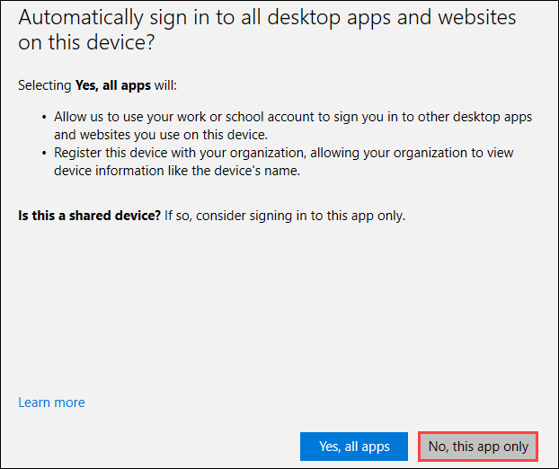

1. Click on **Options and settings (1)** from the left pane and select **Options (2)**.

     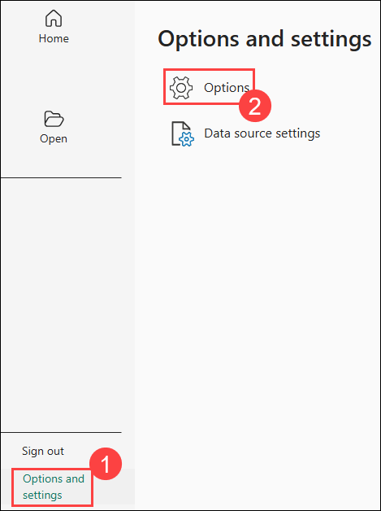

1. Click on **Preview features (1)** from the left pane.Check the box for **Shape map visual (2)** option and click on **OK (3)** to close the dialog.
 
     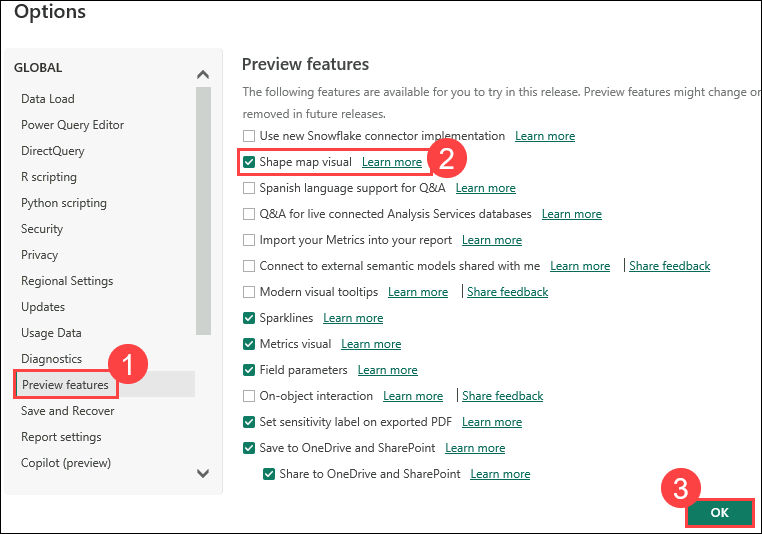

      > **Note:** Click on **OK** when you are prompted with the Feature requires a restart pop-up.

      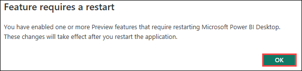      
 
1. From the ribbon, click **File**, then click **Options and settings (1)** and select **Options (2)**.
 
     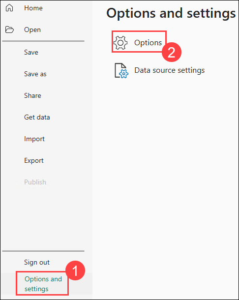
 
1. In the left panel of **Options** dialog box, click **Regional Settings (1)** under Current File. From the Locale drop-down, select **English (United States) (2)** and click on **OK (3)**.

     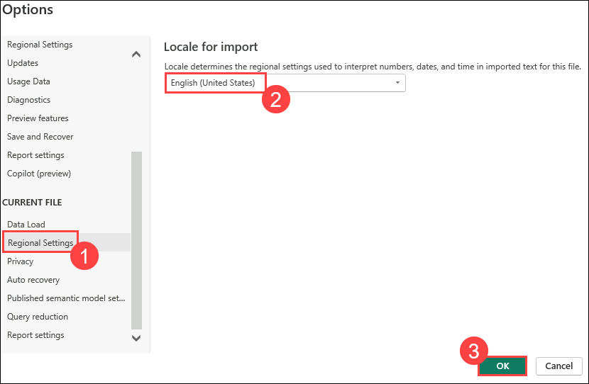
    
1. From the ribbon, click on **Home** and then click the **Get Data (1)** drop-down arrow. Select **Text/CSV (2)**.

     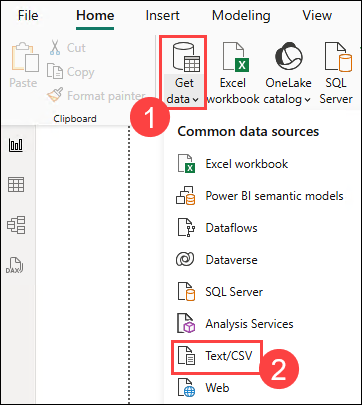

1. Navigate to `C:\DIAD\Attendee\Attendee\Data\USSales`, and select the **sales.csv** file.

1. Click on the **Open** button.

1. Ensure **based on first 200 rows (1)** is selected for Data Type Detection and then click on **Transform Data (2)**.

     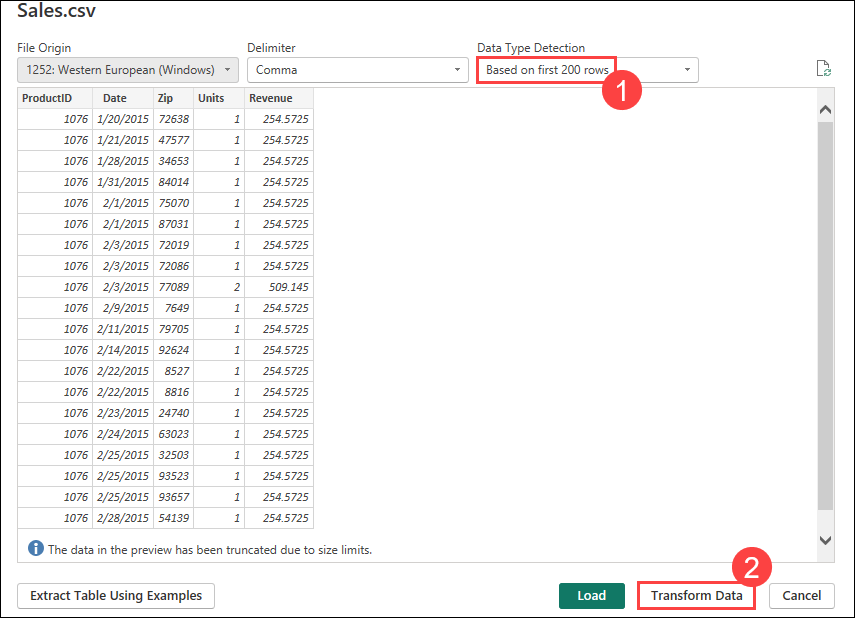
     
     >**Note**: You should be in the Query Editor window as shown in the image below. The Query Editor is used to perform data shaping operations. Notice that the sales file you connected to shows as a query in the left panel. You can see a preview of the data in the center panel. Power BI predicts the data type of each field (based on the first 200 rows) as indicated next to the column header. In the right panel, steps that the Query Editor performs are recorded in the Applied Steps section.    
     
     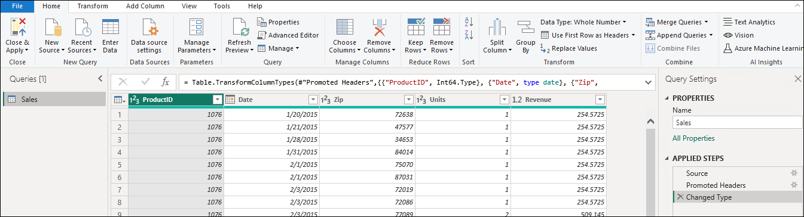
     
     >**Note**: You will bring in sales data from other countries as well as performing certain data shaping operations.

1. Select the **Zip column**. Then, from the ribbon, click **Home**, click **Data Type (1)**, and change it to **Text (2)**.

     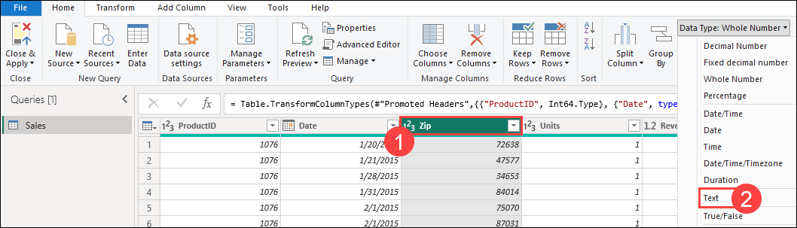

1. The **Change Column Type** dialog box opens. Click on the **Replace Current** button which overwrites Power BI’s predicted data type.
    
1. From the ribbon, click **Home**, click **New Source (1)**, and select **Excel Workbook (2)**.

     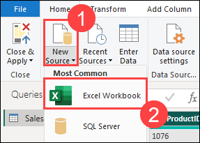
    
1. Browse to `C:\DIAD\Attendee\Attendee\Data\USSales`, and select the **bi_dimensions.xlsx** file.

1. Click on the **Open** button. The **Navigator** dialog box opens.
    
1. Select **product** from the left pane. In the preview panel, notice that the first row is the headers. This is not part of the data.
 
     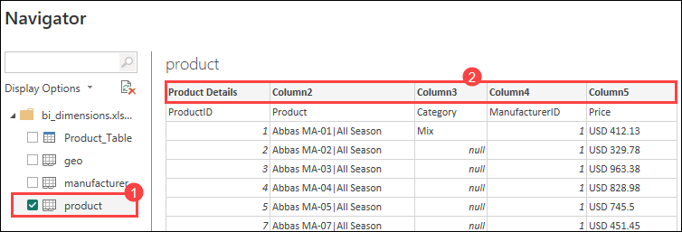

1. Now, deselect **product** from the left panel and click on **Product_Table**. Notice that this table has only the contents of the named table. This is the data we need.

     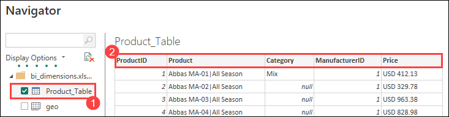
    
   >**Note**: Table names are differentiated from Worksheet names by using different icons.
    
1. From the left panel, click on **geo**. In the preview panel, notice that the first few rows are headers and are not part of the data.

1. From the left panel, click **manufacturer**. In the preview panel, notice that the last couple of rows are footers and are not part of the data.

1. Make sure that **Product_Table**, **geo** and **manufacturer** **(1)** are selected in the left panel and then click on **OK (2)**. 

     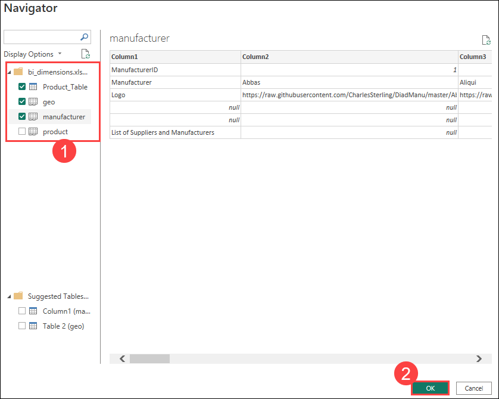

### Task 2: Adding additional data

1. On the **Home** tab of the Query Editor, click on the **New Source (1)** drop-down menu. Select **More… (2)**.

     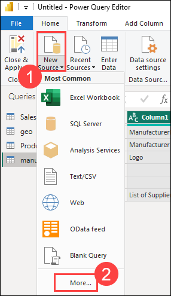
    
    > **Note:** The Get Data dialog box opens.

1. In the **Get Data** dialog box, select **Folder (1)** . Click **Connect (2)**.

     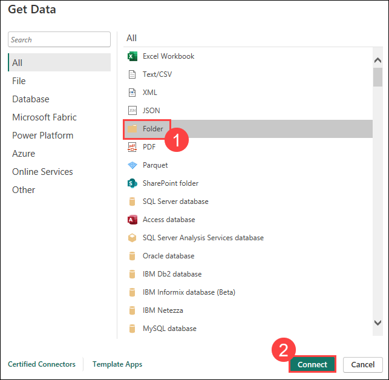
    
1. Click on the **Browse… (1)** button. In the **Browse** for Folder dialog box, navigate to `C:\DIAD\Attendee\Attendee\Data` and click on the **InternationalSales (2)** folder. Click on **OK (3)** (to close the **Browse for Folder** dialog box). Click on **OK (4)** again.

     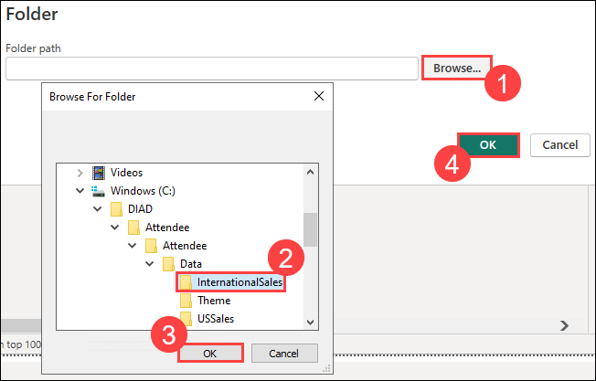

1. Click on **Combine & Transform Data**.
 
     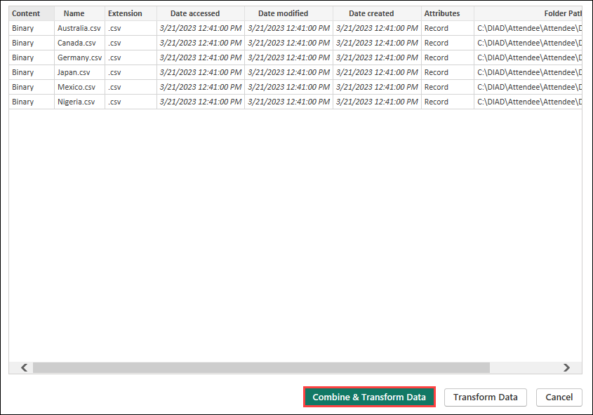
    
     >**Note**: The data in your file for **Date accessed**, **Date modified**, and **Date created** might be different than the dates displayed in the screenshot. 

1. Ensure the **First File (1)** is selected for Sample file, **comma (2)** is selected for Dilimiter and click on **OK (3)**.

     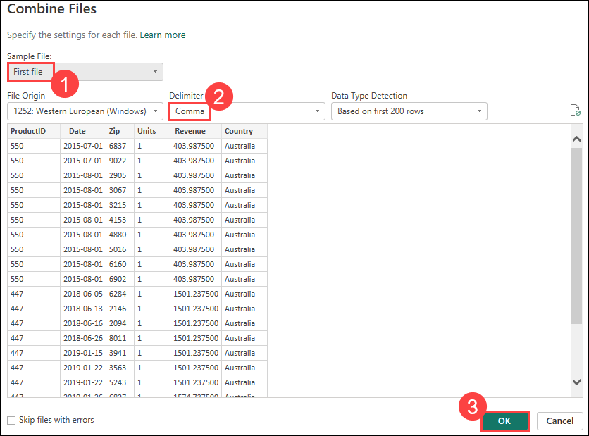

    > **Note:** If you do not see the **Queries** pane on left, click on the > (greater than) icon to expand. 

1. Ensure the Query **InternationalSales** is selected in the left pane.
 
1. Highlight the **Zip** column and change the **Data Type** to **Text**.

     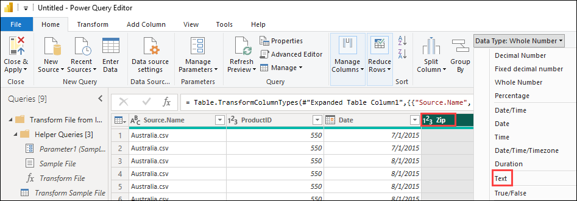

1. The **Change Column Type** dialog box will open. Click on the **Replace Current** button.

1. Click on the **Source.Name** column and right click and select **Remove** option.

     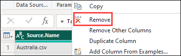    

1. Next, click the drop-down menu next to the **Country** column to see the unique values. Click on **Load more** to validate that you have data from the various countries included.

     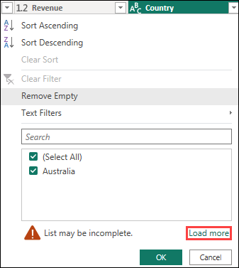    
   
1. Now, you will see the **countries (1)** Australia, Canada, Germany, Japan, Mexico, and Nigeria. Click on **OK (2)**.

     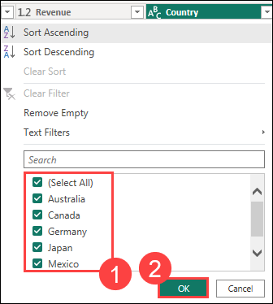

## Summary

In this lab, you have fetched Data and added additional data.

### You have successfully completed the lab!
