# Lab 2 - Data Preparation

### Estimated Duration: 30 Minutes

## Overview

In this lab, you will explore methods to transform data in the data model to ensure it is optimized for reporting. You will perform key transformations such as renaming tables, updating data types, and appending tables to clean and structure the data effectively. These transformations enhance data consistency, improve usability for end users, and streamline the report creation process in Power BI.

## Lab Objectives

- Task 1 - Power BI Desktop – Filling empty values
- Task 2 - Power BI Desktop – Splitting columns

### Task 1 - Power BI Desktop – Filling empty values

1. Under the **Queries** panel, minimize the **Transform Files from InternationalSales** folder.

2. Click each query name in the **Other Queries** section.
   
3. Navigate to **Query Settings**, and then the **Properties** section to rename the queries as shown below:

   | Initial Name             | Final Name            |
   | ------------------------ | --------------------- |
   | Product_Table            |  `Product`            |
   | geo                      | `Geography`           |
   | manufacturer             | `Manufacturer`        |
   | InternationalSales       | `International Sales` |

      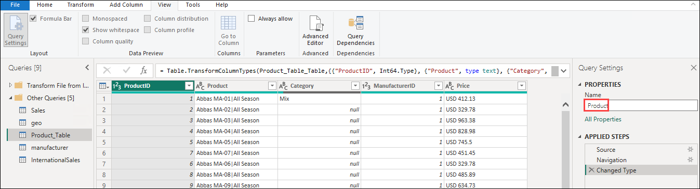

1. In the left panel, click on the **Product (1)** query. Slick the **Category (2)** column. From the ribbon, click on the **Transform** tab , select **Fill (3)**, and then click on **Down (4)**.

      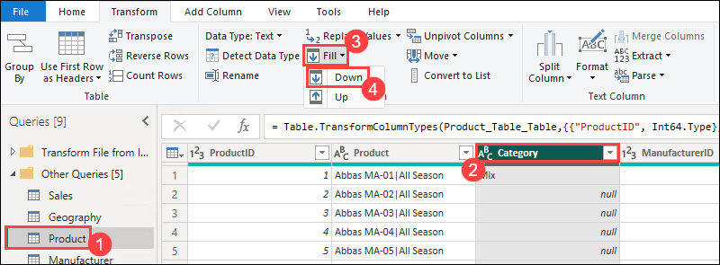

### Task 2 - Power BI Desktop – Splitting columns

In the Product query, notice the Product column. It looks like the product name and product segmentare concatenated into one field with a pipe (|) separator. Let’s split them into two columns. This will be useful when we build visuals, so we can analyze based on both fields.

1. Click on the **Product (1)** column. From the ribbon, click on **Split Column (2)**, and then click **By Delimiter (3)**.

      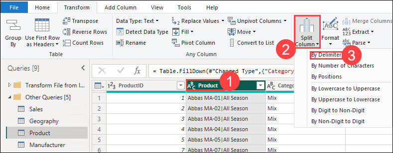

      > **Note:** The Split **Column by Delimiter dialog** box opens.

1. In the dialog box, make sure that **Custom (1)** is selected in the **Select or enter delimiter** drop-down menu. Replace the hyphen symbol with **pipe symbol (|)** **(2)** as shown in the image. Click on **OK (3)**.

      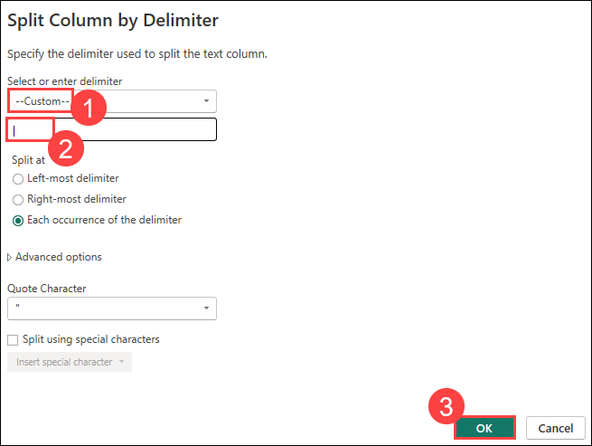

### Task 3 - Power BI Desktop – Renaming columns

1. Click the **Product.1 (1)** column, and then **right-click** next to the column name and click on **Rename… (2)** from the selection menu.

      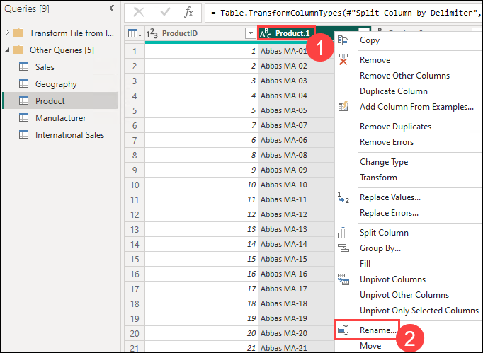

1. **Rename** the field to **Product**.

1. Following these steps, also rename **Product.2** to **Segment**.
        
### Task 4 - Power BI Desktop – Removing unwanted rows

In the **Geography** query, notice that the first two rows are informational. They are not part of the data. Similarly, in the Manufacturer query, the last couple of rows are not part of the data. Let’s remove them so we have a clean dataset.

1. In the left panel, click on the **Geography (1)** query. From the ribbon, click on **Home**, click on the **Remove Rows (2)** dropdown and then select **Remove Top Rows (3)**.

      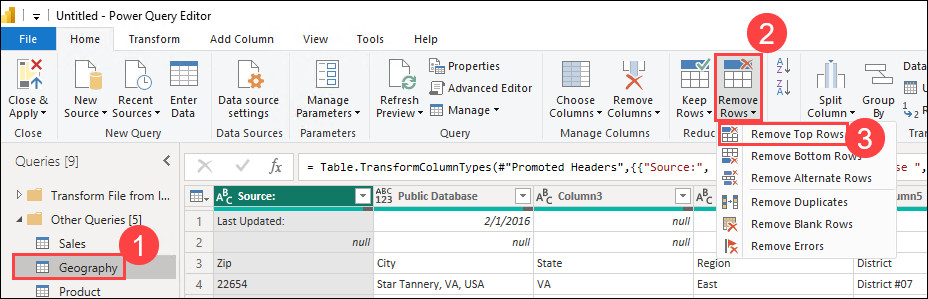

1. The **Remove Top Rows** dialog box opens. Enter **2** in the text box and click on **OK**.
    
      >**Note**: Notice the first row in the Geography query is now the column header. Let’s make it a header.

1. With **Geography** query selected in the left panel, from the ribbon click **Home**, and then click **Use First Row as Headers**.

      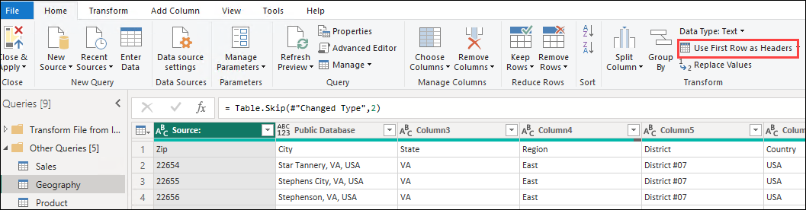

1. Click on **123 (1)** next to the Zip Column. From the dialog box, select **Text (2)**.

      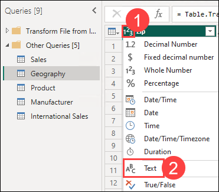

1. Click **Replace Current** in the **Change Column Type** dialog box.

1. From the left panel, click on the **Manufacturer (1)** query. From the ribbon, click on the **Home** tab, click on the **Remove Rows (2)** dropdown and then select **Remove Bottom Rows (3)**.
 
      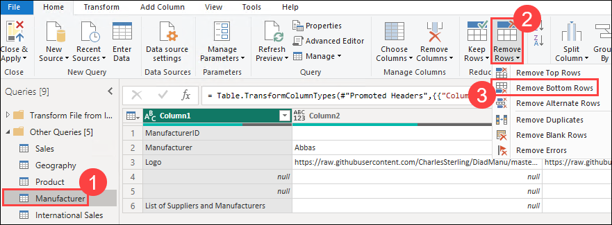

1. The **Remove Bottom Rows** dialog box opens. Enter **3** in the **Number of rows text box** and click on **OK**.
   
### Task 5 - Power BI Desktop – Transposing data

1. From the left panel, click on the **Manufacturer (1)**, click on the **Transform** and then click **Transpose (2)**.

      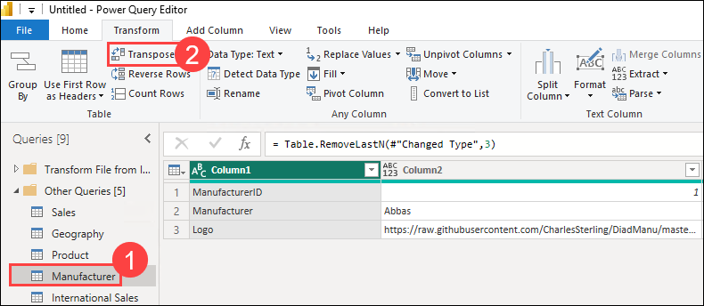

1. From the ribbon click **Home** and then click **Use First Row as Headers**.

      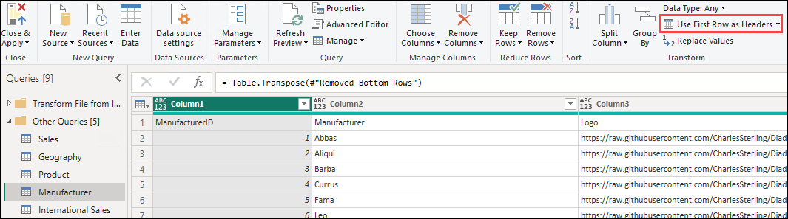

      > **Note:** Notice that now the **Manufacturer** table is laid out the way we need it with a header and values along columns.

### Task 6 - Power BI Desktop – Appending queries

To analyze the Sales of all countries, it is convenient to have a single **Sales** table. To do this, you need to append all the rows from the **International Sales** query to the **Sales** query.

1. Click on the **Sales (1)** query in the Queries window in the left panel. From the ribbon click on the **Home** tab and then click **Append Queries (2)**. 

      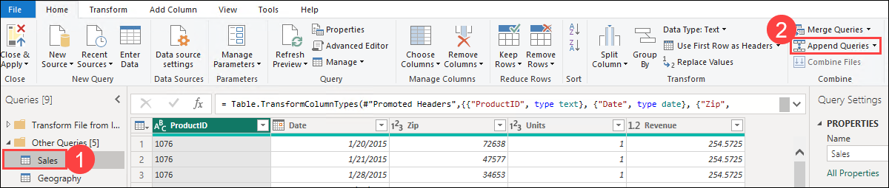

1. In the Append dialog box, keep the default **Two Tables (1)** checked, select **International Sales** from the drop-down and then click on **OK (2)**.

      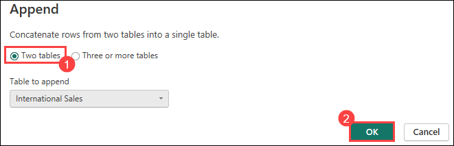
    
      > **Note:** You will now see a new column in the **Sales** table called **Country**. Since the International **Sales** query had the additional column for **Country**, Power BI Desktop added the column to the **Sales** table when it loaded the values from the **International Sales** query. 

1. Keep the **Sales (1)** query selected. From the ribbon, select **Conditional Column (2)**.

      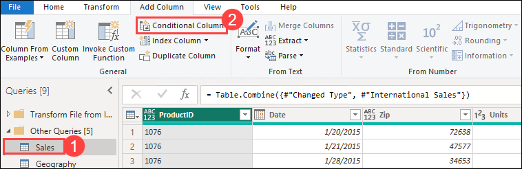
    
1. In the **Add Conditional Column** dialog box, add the below values and click on **OK (8)**:

   - Enter the name of the column as “**CountryName (1)**”
   - Select the **Country (2)** from the **Column Name** drop-down menu
   - Select the **equals (3)** from the **Operator** drop-down menu
   - Enter **null (4)** in the **Value** box
   - Enter **USA (5)** in the **Output** box
   - Click on the drop-down menu under **Else** and then click the **Select a column (6)** option
   - Click on the **Country (7)** from the column drop-down menu

       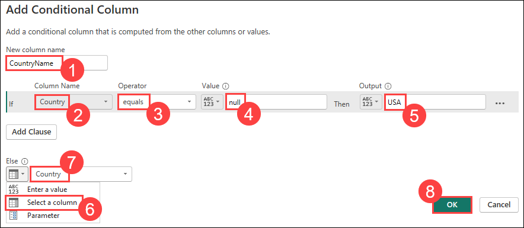
     
1. You will see the **CountryName** column in the Query editor window.
   
1. Right-click on the **Country** column and click **Remove** as shown in the figure.
 
   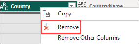

1. Right-click on the **CountryName** column and rename it to **Country**.

1. Using Home then **Data Type (1)** or by selecting the data type next to the column header, change the **data type** of the **Country** column to **Text (2)**.

   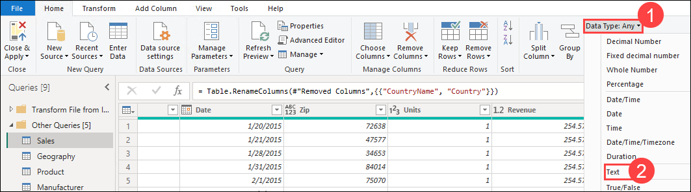

1. Using **Home** then **Data Type** or by selecting the data type next to the column header, change the **data type** of the **Revenue** column to **Fixed Decimal Number** because it is a currency field.

1. At first, you will only see USA data. Click on **Load more** to validate you have data from all eight countries. 

   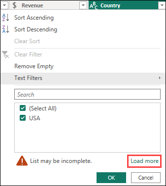

1. Click on **OK** to close this filter.

   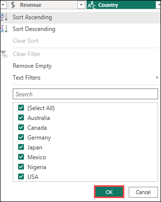

1. Click the **arrow** next to **Date** in the **Sales** Query.

1. Click on the **Date Filters** and then click **In the Previous…**

   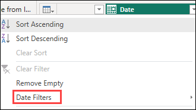
    
1. The **Filter Rows** dialog box opens. Enter **3 (1)** in the text box next to **is in the previous (2)**. Click **years** from the drop-down menu. Click on **OK**.

      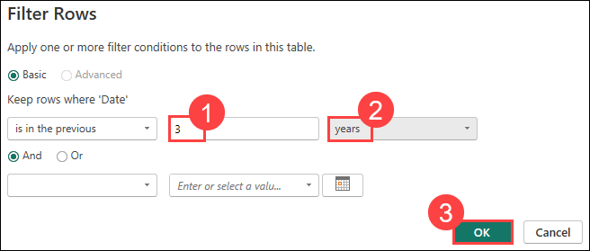

      > **Note:** Our dataset has data from 2022 to 2024. For our analysis we want to start with the last three years of data (2022-2024). We don’t yet know how many rows will result. We can filter by year to get the subset.
   
1. From the Queries panel on the left, click the **International Sales** query. Right-click and then click **Enable Load**. This will disable loading International Sales.

      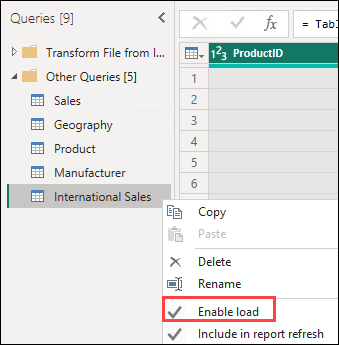
    
     >**Note**: The appropriate data from the International Sales table will load into the Sales table each time the model is refreshed. By removing the International Sales table, we are preventing duplicate data from loading into the model and increasing its file size. In some instances, storing very large amounts 
of data affects the data model performance.
 
1. From the ribbon click **View** and then click **Query Dependencies**.

   > **Note:** This opens the **Query Dependencies** dialog box. The dialog box shows the source of each query and its dependencies. For example, we see that the Sales query has a CSV file source and a dependency on the International Sales query. This is a useful information to share knowledge with your team members.

   

58. Click **Close** in the dialog box.

Note that you can zoom in and out of the **Query Dependencies** view as needed.

You have now successfully completed import and data shaping operations and are ready to load the data into the Power BI Desktop data model to visualize the data. 

59. Click **File** and then click **Close & Apply**. This will close out the power query window and apply all changes.

    
    
    All the data will be loaded in memory in the Power BI Desktop. You will see the progress dialog box with the number of rows being loaded in each table as shown in the Figure.
    
    
    
    >**Note**: It may take several minutes to load all the tables.

60. Click **File** and then click **Save** to save the file after the data loading is complete. Name the file as “**MyFirstPowerBIModel**”. Save the file in the DIAD Reports (**\DIAD\Reports**) folder.

61. On the left panel, click **Data  icon**  to view the data that was loaded. If you need to open Power Query editor, navigate to Home -> Transform Data -> Transform data.

    
     
### You have successfully completed the lab!
