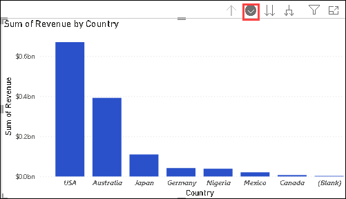
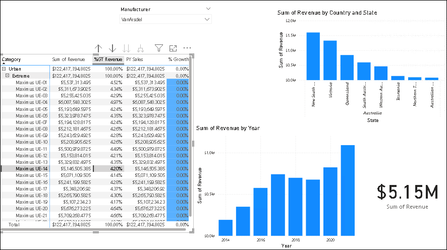
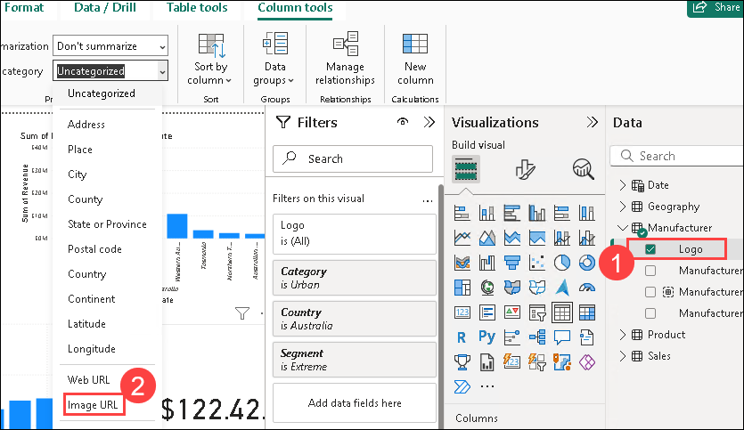

# Lab 4 - Data Visualization

### Estimated Duration: 30 Minutes

## Overview

In this lab, you will explore data visualization techniques using Power BI to transform raw data into meaningful insights. You will learn how to connect to various data sources, create interactive reports, and design compelling dashboards. The lab covers key visualization elements such as charts, graphs, slicers, and filters, helping you enhance data storytelling and decision-making. By the end, you will have hands-on experience in building visually impactful reports that drive business insights.

### Task 1: 

1. Navigate to `C:\DIAD\Attendee\Attendee\Data`, move the `Data` file to `C:\DIAD`.

1. Navigate to `C:\DIAD\Attendee\Attendee\Reports` and select the **Lab 2 solution.pbix**.

1. In the **Lab 2 solution.pbix** report, with the **Matrix (1)** visual selected, navigate to the **Values** section and click on the downwards facing arrow next to **% Growth (2)**.

    

1. Click on **Conditional Formatting (1)** and then click **Background color (2)**. 

    

1. Click on the **Add a middle color (1)** checkbox and click on **OK (2)**.

    

1. From the **ribbon**, click **Home** and then click **Transform Data**. 

    

1. Click the **filter** button on the **Date** column. Click on the **Clear filter** button to remove the 3-year filter and click on **OK**.

    

1. From the **Home (1)** tab, click on **Close & Apply (2)** to load the data.

    

1. Enable drill down mode on the **Sum of Revenue by Country** visual

    

1. Click on **Australia** to drill down to **State.**

1. Disable drill mode on the **Sum of Revenue by Country and State** visual

1. At this point, your report page should look like the image below.

    

1. Once data is loaded, notice **Revenue by Year visual**. You will see columns for years 2014 through 2022.

1. Hover over **Manufacturer slicer (1)** visual on the Canvas. From the Visualizations pane, click on the **Format** visual and select **Tile (2)** in the Options dropdown.

    

1. Notice the **Slicer** visual is updated. 

    > **Note**: There are other options to change the outline color, weight, and more.

1. Click **VanArsdel**.

1. Now, collapse the **General** section.

1. From the **Data** section, double click on the **Logo (1)** field in the **Manufacturer** table. From the ribbon, **Column tools** will be selected, click on **Data Category** and then select **Image URL (2)**. 

    

1. From the canvas, click the **Manufacturer** slicer.

1. From the **Data** section, drag and drop the **Logo** from the **Manufacturer** table to the **Field** box replacing the **Manufacturer** column.

1. **Resize** the slicer visual as needed.

    

1. Click the **VanArsdel** logo to filter all the other visuals.

1. Click on the **Sum of the Revenue by Year** visual. From the **Visualizations** panel, click on the **Line and clustered (1)** column chart to change the visual type. From the **Data** section, drag and drop the **% Growth (2)** field from the **Sales** table to the **Line y axis (3)**.

    

1. Duplicate the current visual and place it in another location on the Canvas.

1. Select the copied visual. From the **Visualizations** panel, click on the **Gauge (1)** visual. From the **Data** section, drag and drop the **PY Sales (2)** field to the **Target value (3)**.

    

1. Resize the visual as needed. 

1. Click the **Gauge** visual. From the **Visualizations** panel, click on the **format visual (1)** icon. Expand the **Colors** section. Click on the arrow next to **Fill (2)** color.

    

    > **Note:** Notice you can pick a color from the default color palette or pick More colors.

1. From the ribbon, click on **View (1)**, click **Themes**, and then click on **Browse for themes (2)**.

    

1. A file browser dialog box opens. Navigate to the `C:\DIAD\Data\` and click on **Theme** folder.

1. Click the **DIADTheme2** file and then click on **Open**.

1. Once the theme is imported, a success dialog box opens. Click **Close**.

    > **Note:** Notice colors on all the visuals are updated. Your report should look like the image at this point. This theme looks good. Now, most of the visuals are blue, so let’s add some contrast.

1. Click on the **Gauge** visual. From the **Visualizations** panel, click the **format visual** icon.

1. Expand the **Data colors** section.

1. Click the drop-down menu next to **Target**. Notice the color palette is different now.

1. Click the **black** color. Notice how it changes in the visual.

1. Collapse the **Data colors** section.

    

49. Expand the **Data Labels** section.

50. Change the **Text size** to **10**.

51. Expand the **Target Labels** section.

52. Change the **Text size** to **10**.

    

53. Click the **Matrix** visual.

54. Drill up to the **Segment** level.

55. Click the **Sum of Revenue by Country and State** visual.

56. Drill up to the **Country** level.

60. Expand the **y axis** section, turn the Values to ON and select Millions from the dropdown.

62. Let’s move to another visual, click the **Revenue and % Growth by Year** visual.

63. From the **Visualizations** panel, click the **format visual** icon.

64. Expand the **Data colors** section.

65. Select the **black** color for **% Growth.**

66. Select a light shade of **gray** as the **Default color**.

    

Now let’s add a report title.

67. From the ribbon, click **Home** and then click **Text box**. Notice a text box visual is added.

68. **Resize** the visual as needed.

69. Enter **Manufacturer Analysis** in the text box.

70. Highlight **Manufacturer Analysis** to format the text.

71. Select **Segoe (Bold)** as the **font**.

72. Select **36** as the **font size**.

73. Resize the text box as needed.

74. Notice the additional formatting option that have been added highlighted in black (superscript, subscript, and bulleted lists)

    

75. From the ribbon, click **View**.

76. Click the checkbox next to **Show Gridlines** and **Snap to Grid**. This will help with aligning the visuals.

    

77. Uncheck the **Show Gridlines** and **Snap to Grid** options to disable these features.

78. Right-click the page name in the lower-left corner and then click **Rename**.

79. Rename the page to **Manufacturer**.

    

We can also use a background image to format the reports. Let’s try it.

80. Click the white space in the canvas.

81. From the **Visualizations** panel, click the **format visual** icon.

82. Expand the **Canvas Background** section.

83. On the **Image** button, click on Browse.

84. A File browser dialog box opens. Browse to the **DIAD** folder then the **Data** folder (/DIAD/Data).

85. Click the **Background** file.

86. Click **Open**.

    

87. From **Image Fit** drop-down, click **Fit**.

88. Slide **Transparency** slider to **0%**.

    

Notice we have a template which has a place for header and slots for images.

89. **Resize** and **arrange** the visuals as shown in the screenshot

    

Now let’s add a logo.

90. From the ribbon, click **Insert** and then click **Image**

91. The **File browser** dialog opens. Browse to the **DIAD** folder then the **Data** folder (/DIAD/Data).

92. Change the file type to **All files(\*).**

93. Click the **VanArsdel\_Logo** file.

94. Click **Open**.

    

95. **Resize** the visual as needed.

96. **Drag** the visual to the top left corner of the page.

>**Note:** The logo is transparent. You need to place it on the blue background to see it.

Now let’s change the font color of the report title.

97. Highlight **Manufacturer Analysis**.

98. Click the arrow next to the **A** for the font color. Select the **white** color.

99. Change the **size** of the **font** to **24**

    

100. Click on **Background** in the **Visualizations** pane and select the blue color shown below.

     

Now let’s add a smart narrative visual to our report.

101. First resize the Revenue by Year visual

     

102. Add a smart narrative visual to the canvas

     

Out of the box, Power BI has a large selection of visuals. However, there may be a use-case when you need a custom visual. To meet this requirement, the visualization engine is open-sourced. The Power BI community contributes visuals in the marketplace. You can add and use these visuals in your reports.

There is also an option to create your own visual and import it into Power BI Desktop.

Now let’s add a custom visual.

103. From **Visualizations** section, click the ellipse in the last row of visuals.

104. Click **Get more visuals**.

     

105. Type **play axis** in the **search box** and click the **Search** icon.

106. Click the **Add** next to the **Play Axis (Dynamic Slicer)**.

     

**Note**: Notice the checkmark in the blue star. This image is used to identify certified custom visuals. Custom visuals that meet Power BI teams coding requirements are certified. Certified custom visuals support features like export to PowerPoint and the ability to display in subscription emails which are not supported by non-certified custom visuals.

107. The **import custom visual** dialog opens. Click Get it now

     

108. Notice a new visual is added to the list of available visuals.

109. Click on the white space in the canvas.

110. From the **Visualizations** section, click the newly imported **Play Axis** visual.

111. From the **Data** section, click the checkbox next to the **Date** field in the **Date** table.

112. From the **Visualizations** panel, click the **format visual** icon.

113. Expand the **Colors** section.

114. Enable the **Show all** option.

115. **Resize** and **position** the visual as shown in the screenshot below.

     

Now that we have a report ready, let’s use Bookmarks to tell the story we discovered. Bookmarks capture the currently configured view of a report page, including filtering and the state of visuals which helps to make it easier to present the story.

116. From the ribbon, click **View**.
 
117. Click the **Bookmarks** button to enable Bookmarks. The **Bookmarks** pane opens.

     

118. Click on **Add** in the **Bookmarks** pane. This will add the current state of the visual to the bookmark.

119. Click the **ellipse** next to the newly created **Bookmark 1**.

120. Click **Rename** and change the name to **Initial State**.

121. In the **Revenue by Country** visual, click the **USA** column.

122. Hover over the **Revenue by Country** visual and click the **ellipse** on the top right corner.

123. Click **Spotlight**.

124. In the **Bookmarks** pane, click **Add**. This will add a new bookmark with the current state of the report.

125. Change the bookmark name to **USA Revenue**

     

126. Click on the canvas.

127. Click **Australia** in the **Revenue by Country** visual.

128. In the **Bookmarks** pane, click **Add**. This will add a new bookmark with the current state of the report.

129. Change the bookmark name to **Australia Revenue**

     

130. From the **Bookmarks** pane, click **View**. You are now in Bookmarks slide show mode. You will be in the first bookmark, which we called **Initial State**. Notice on the bottom of the report pane there is an option to navigate between bookmarks.

131. You can use the arrows to navigate between bookmarks and tell your story.

     

132. From the **Bookmarks** pane, click **Exit** to exit the Bookmarks slide show mode.

If time permits, feel free to explore other options available with Bookmarks, such as **Selected Visuals**, as you continue to build your story.

133. From the ribbon, click **View**.

134. Uncheck the **Bookmarks Pane**.

135. Collapse the **Visualizations** and **Filters** pane by clicking on the arrows

Now let’s add bookmark navigator buttons to the canvas

1. From the ribbon, click the **Insert** ribbon.

2. Click on **Button** and select **Navigator** -> **Bookmark navigator**

   

3. Arrange the Bookmark navigator to fit on the page as shown below

   

4. Click on the heading Fill and change the Fill color to a light blue and set Transparency to 40

   

5. Click on the heading **Shape**, there is a long list of shapes to choose from, let’s pick **Rounded Rectangle**

   

Feel free to test out the new functionality.

Your report should look as shown in the figure below. Now let’s finish up by saving the file.

  

6. Click **File** and then click **Save**.

You have built your first report!

You have successfully completed the hands-on lab by creating a report to share to your team. The nextlab covers creating a dashboard from this report to share with your team. You have seen an overview of the functionality in Power BI Desktop. There are many more features for you to explore with your data!

### You have successfully completed the lab!
