# Lab 4 - Data Visualization

### Estimated Duration: 60 Minutes

## Overview

In this lab, you will explore data visualization techniques using Power BI to transform raw data into meaningful insights. You will learn how to connect to various data sources, create interactive reports, and design compelling dashboards. The lab covers key visualization elements such as charts, graphs, slicers, and filters, helping you enhance data storytelling and decision-making. By the end, you will have hands-on experience in building visually impactful reports that drive business insights.

### Task 1: 

1. Navigate to `C:\DIAD\Attendee\Attendee\Data`, move the `Data` file to `C:\DIAD`.

1. Navigate to `C:\DIAD\Attendee\Attendee\Reports` and select the **Lab 2 solution.pbix**.

1. In the **Lab 2 solution.pbix** report, with the **Matrix (1)** visual selected, navigate to the **Values** section and click on the downwards facing arrow next to **% Growth (2)**.

    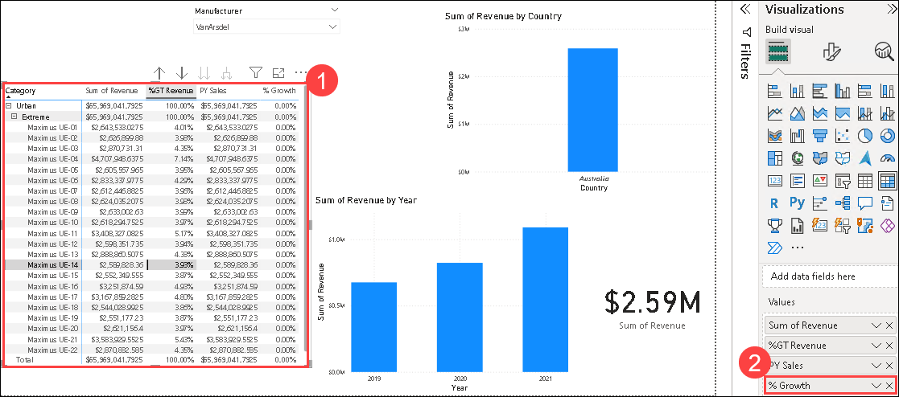

1. Click on **Conditional Formatting (1)** and then click **Background color (2)**. 

    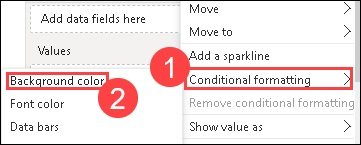

1. Click on the **Add a middle color (1)** checkbox and click on **OK (2)**.

    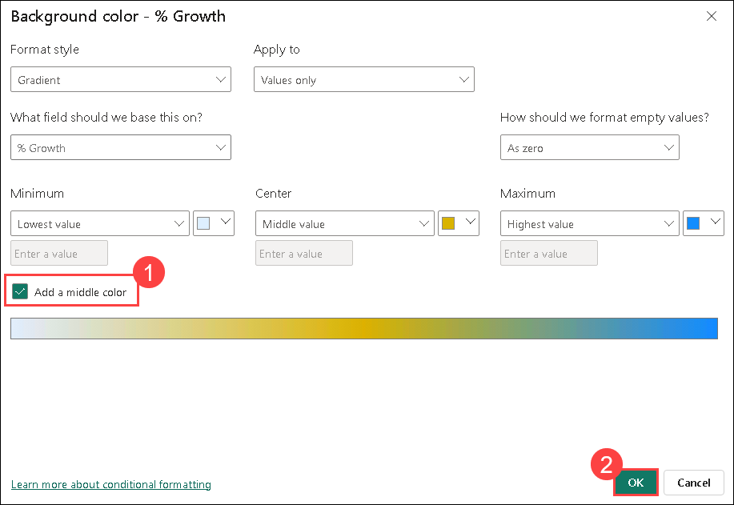

1. From the **ribbon**, click **Home** and then click **Transform Data**. 

    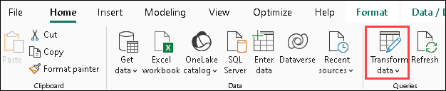

1. Click the **filter** button on the **Date** column. Click on the **Clear filter** button to remove the 3-year filter and click on **OK**.

    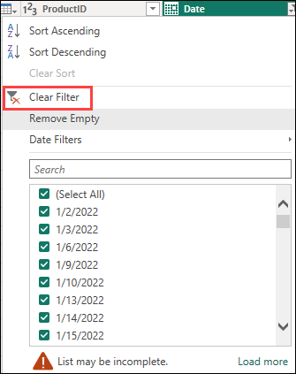

1. From the **Home (1)** tab, click on **Close & Apply (2)** to load the data.

    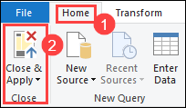

1. On the **Sum of Revenue by Country** visual, click on **Australia** to drill down to **State.**

    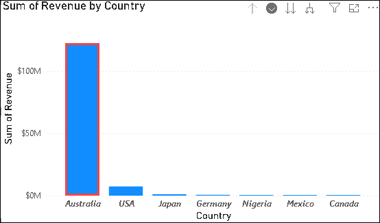

    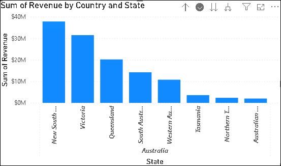   

1. Disable drill mode on the **Sum of Revenue by Country and State** visual by clicking on **Drill up**.

    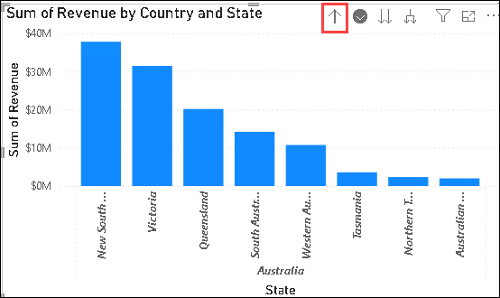

1. At this point, your report page should look like the image below.

    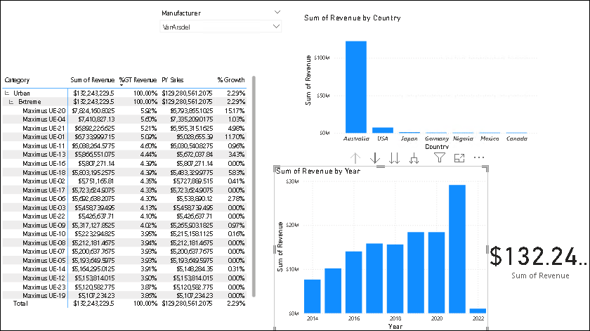

1. Once data is loaded, notice **Revenue by Year visual**. You will see columns for years 2014, 2016, 2018, 2020 and 2022.

1. Hover over **Manufacturer slicer (1)** visual on the Canvas. From the Visualizations pane, click on the **Format visual**, click on the dropdown for **Slicer Settings** and select **Tile (2)** in the Options dropdown.

    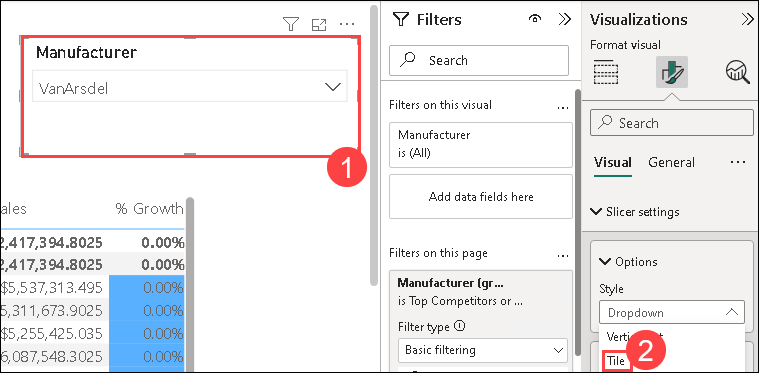

1. Notice the **Slicer** visual is updated. 

    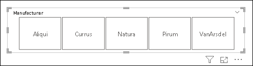

    > **Note**: There are other options to change the outline color, weight, and more.

1. Click on **VanArsdel**.

    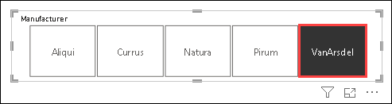

1. From the **Data** section, double click on the **Logo (1)** field in the **Manufacturer** table. From the ribbon, **Column tools** will be selected, click on **Data Category (2)** dropdown and then select **Image URL (3)**. 

    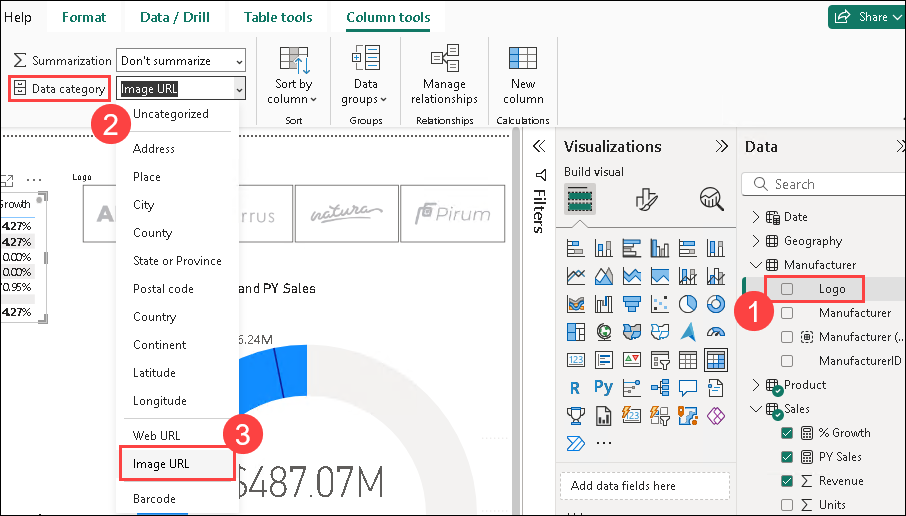

1. From the canvas, click the **Manufacturer** slicer.

1. From the **Data (1)** section, drag and drop the **Logo** from the **Manufacturer** table to the **Field (2)** box replacing the **Manufacturer** column. The **logos (3)** will load in the visual.

    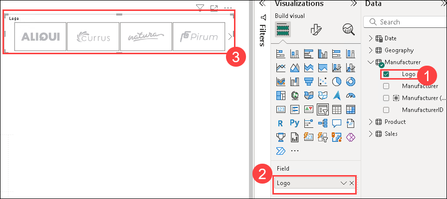

1. **Resize** the slicer visual as needed.

    

1. Click the **VanArsdel** logo to filter all the other visuals.

1. Click on the **Sum of the Revenue by Year** visual. From the **Visualizations** panel, click on the **Line and clustered (1)** column chart to change the visual type. From the **Data** section, drag and drop the **% Growth (2)** field from the **Sales** table to the **Line y axis (3)**.

    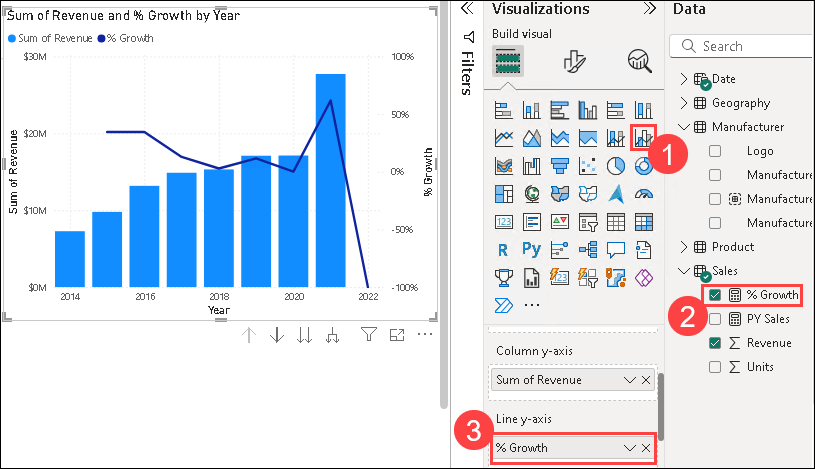

1. Duplicate the current visual and place it in another location on the Canvas.

1. Select the copied visual. From the **Visualizations** panel, click on the **Gauge (1)** visual. From the **Data** section, drag and drop the **PY Sales (2)** field to the **Target value (3)**.

    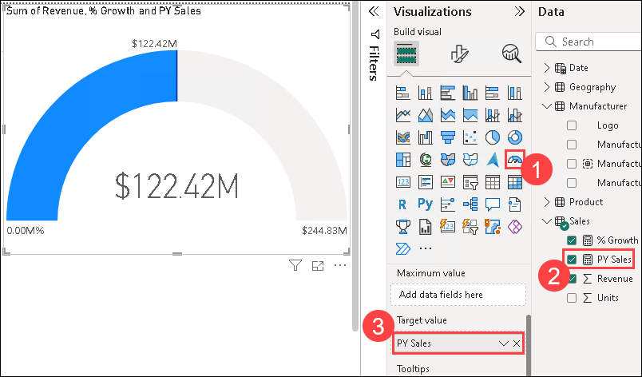

1. Resize the visual as needed. 

1. Click the **Gauge** visual. From the **Visualizations** panel, click on the **format visual (1)** icon. Expand the **Colors** section. Click on the arrow next to **Fill (2)** color.

    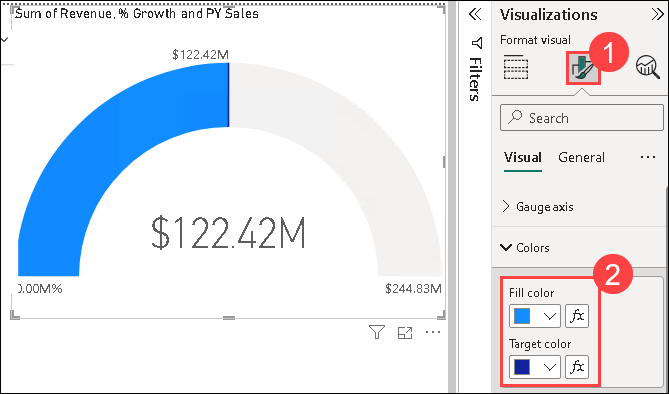

    > **Note:** Notice you can pick a color from the default color palette or pick More colors.

1. From the ribbon, click on **View (1)**, click **Themes**, and then click on **Browse for themes (2)**.

    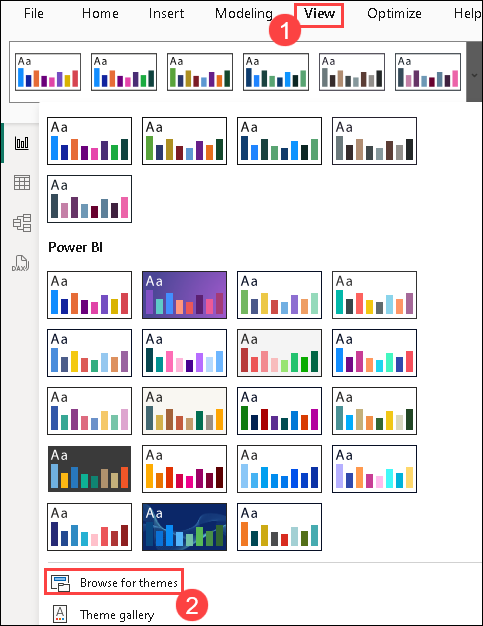

1. A file browser dialog box opens. Navigate to the `C:\DIAD\Data` and click on **Theme** folder.

1. Click on the **DIADTheme2** file and then click on **Open**.

1. Once the theme is imported, a success dialog box opens. Click **Close**.

    > **Note:** Notice colors on all the visuals are updated. Your report should look like the image at this point. This theme looks good. Now, most of the visuals are blue, so let’s add some contrast.

1. Click on the **Gauge** visual. From the **Visualizations** panel, click the **format visual** icon.

1. Expand the **Colours** section. Click on the drop-down menu next to **Target** and select the **black** color. 

    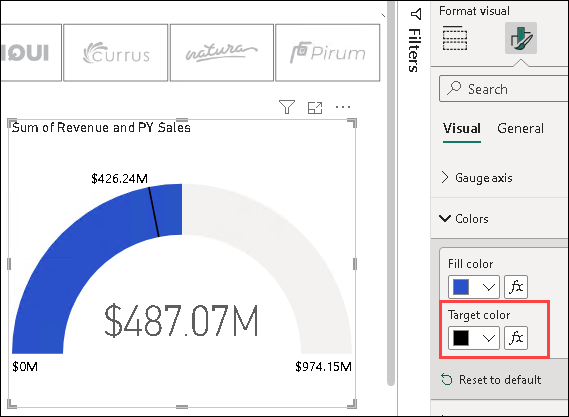

1. Collapse the **Colors** section.

1. Expand the **Data Labels (1)** section and change the **Text size** to **10 (2)**.

    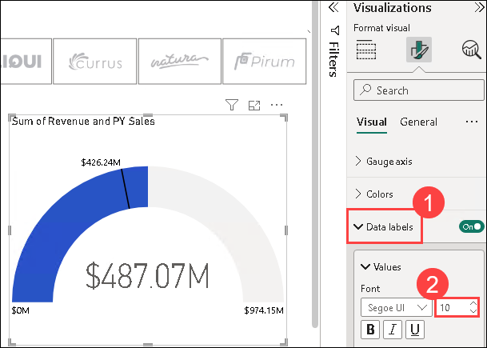

1. Expand the **Target Labels** section and change the **Text size** to **10**.

1. Select the **Matrix** visual and drill up and down until the **Segment** Column appears.

    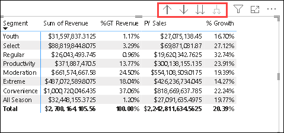

1. Click on the **Sum of Revenue by Country** visual and navigate to the **Format Visual** in the Visualizations pane.

1. Expand the **y axis** section, turn the Values to **ON (1)** and select **Millions (2)** from the Display Units dropdown.

    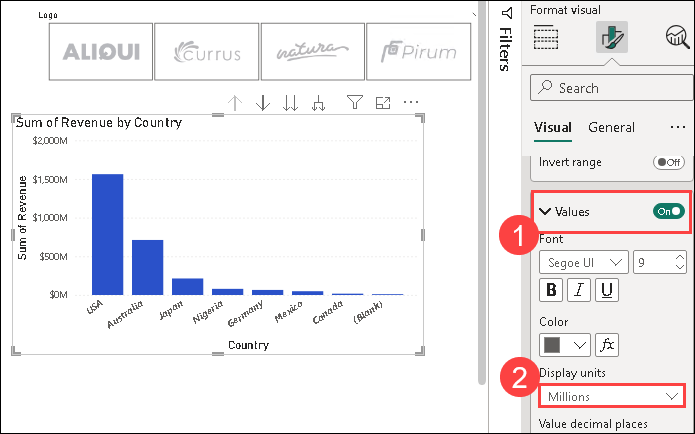

1. Click on the **Sum of Revenue and % Growth by Year** visual.

1. From the **Visualizations** panel, click the **format visual** icon, expand the **Column** section and select **gray** as the **Default color**

    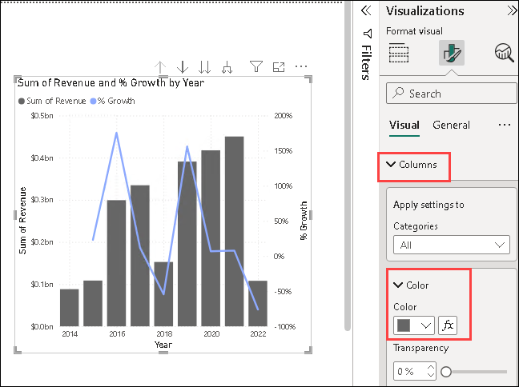

1. Then, click on **Lines** dropdown, further click on **Colour** dropdpwn and select the **black** color for **% Growth.**

    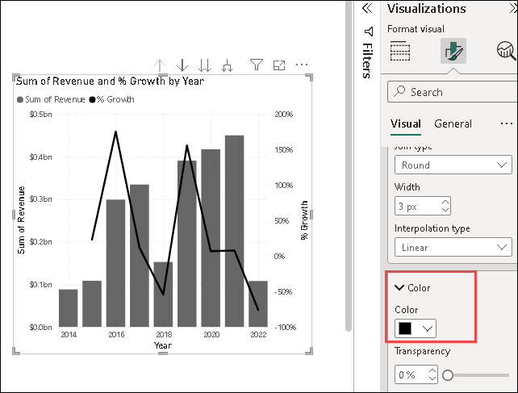

1. From the **Home** tab, click on **Text box** and enter **Manufacturer Analysis (1)** in the text box. Select **Segoe (Bold) (2)** as the **font** and **36 (3)** as the **font size**.

    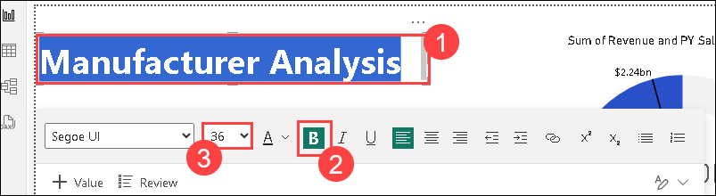

1. Resize the text box as needed.

1. Right-click the page name in the lower-left corner and then click **Rename**.

1. Rename the page to **Manufacturer** from the bottom.

    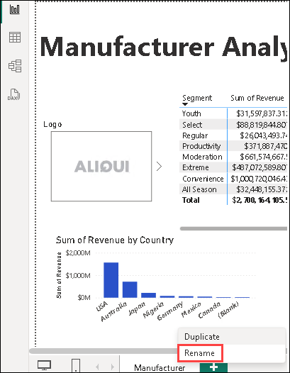

1. Click the white space on the canvas.

1. From the **Visualizations** panel, click on the **format visual** icon. Expand the **Canvas Background** section and On the **Image** button and click on **Browse**.

    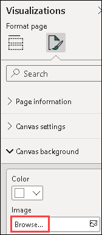

1. Navigate to `C:/DIAD/Data` and click on the **Background** file.

1. Click on the **Open** button.

    

1. From **Image Fit** drop-down, select **Fit (2)** and slide to **0% (3)** for **Transparency**.

    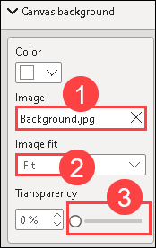

1. **Resize** and **arrange** the visuals as shown in the image.

    

1. From the ribbon, click on the **Insert (1)** tab and select **Image (2)**.

    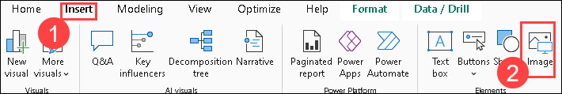

1. Navigate to `C:/DIAD/Data` and select the **VanArsdel\_Logo** file.

1. Click on the **Open** button.

1. **Resize** the visual as needed.

1. **Drag** the visual to the top left corner of the page.

    

     >**Note:** The logo is transparent. You need to place it on the blue background to see it.

1. Highlight **Manufacturer Analysis (1)**, click on the arrow next to the **A** for the font color and select the **white (2)** color. Change the **size** of the **font** to **24 (3)**.

    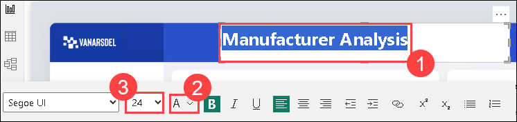

1. From the Format text box, click on the **Effects (1)** dropdown, click on **Background (2)** and select the **blue (3)** color as shown in the image.

    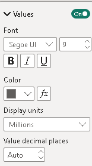

1. From **Visualizations** section, click on the **ellipsis** in the last row of visuals and select **Get more visuals**.

     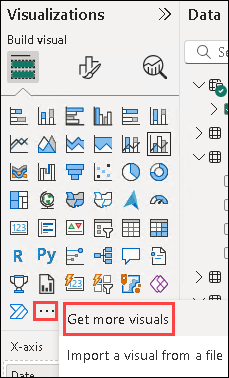

1. Type **play axis (1)** in the **search box** and select the **Play Axis (2)** Visual.

     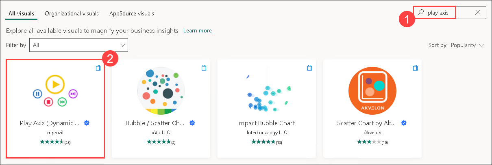

1. Click on **Add**.

     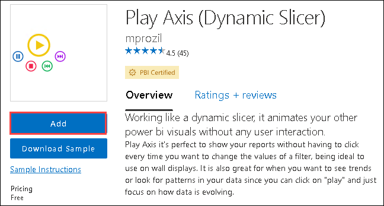

1. Notice a new visual is added to the list of available visuals.

1. Click on the newly imported **Play Axis (1)** visual. From the **Data** section, click on the checkbox next to the **Date (2)** field in the **Date** table.

1. From the **Visualizations** panel, click on the **format visual** icon, expand the **Colors** section and enable the **Show all** option.

1. **Resize** and **position** the visual as shown in the image below.

    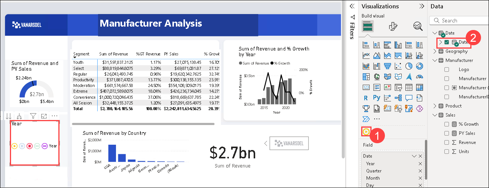
   
1. From the ribbon, click on **View**. Click on the **Bookmarks** button to enable Bookmarks. 

1. Click on **Add** in the **Bookmarks** pane. This will add the current state of the visual to the bookmark.

1. Click on the **ellipsis** next to the newly created **Bookmark 1**, click **Rename** and change the name to **Initial State**.

1. In the **Sum of Revenue by Country** visual, click on the **USA** column.

1. Hover over the **Sum of Revenue by Country** visual, click on the **ellipsis** on the top right corner.

1. Click on **Spotlight (1)**. In the **Bookmarks** pane, click on **Add** and change the bookmark name to **USA Revenue**

1. Click on the canvas.

1. Click **Australia** in the **Revenue by Country** visual. In the **Bookmarks** pane, click **Add** and change the bookmark name to **Australia Revenue**

1. Click on any bookmark that we have created and it will re-direct you to that visual.

1. From the ribbon, click **View** and uncheck the **Bookmarks Pane**.

1. Collapse the **Visualizations** and **Filters** pane by clicking on the arrows
    
1. From the ribbon, click on the **Insert** tab, select **Button**, click on **Navigator** -> **Bookmark navigator**

   

1. Arrange the Bookmark navigator to fit on the page as shown.

   

1. In the Format Navigator area, select Fill from the Style dropdown and change the Fill color to a light blue.

   

1. Click on the **Shape** dropdown and select **Rounded Rectangle**.

   

1. Your report should look as shown.

1. Click **File** and then click **Save**.

## Summary 

In this lab, you have successfully completed the hands-on lab by creating a report. 

### You have successfully completed the lab!
