# Lab 5 - Publishing and Accessing Reports

### Estimated Duration: 40 Minutes

## Lab Objectives

In this lab, you will perform:

- Task 1 - Power BI Service – Publishing Report
- Task 2- Power BI – Building a Dashboard

### Task 1 - Power BI Service – Publishing Report

1. Navigate to <http://aka.ms/pbidiadtraining> and sign up:

   * Email/Username: <inject key="AzureAdUserEmail"></inject>

   * Password: <inject key="AzureAdUserPassword"></inject>     

1. Navigate to **app.powerbi.com** [http://app.powerbi.com](http://app.powerbi.com/)[.](http://app.powerbi.com/) and sign in if not already signed in.

1. Few of the options that are listed in the left navigation are as follows:

      - **Home**: This is a one-stop-shop for all your content. It lists your favorite and recent content such as reports, dashboards, and apps. It also shows the most recent content that was shared with you.
      
      - **Create**: Allows you to add data manually or use an already existing dataset.
      
      - **Apps**: List all the apps you have installed.
      
      - **Workspaces**: Lists all the workspaces you are assigned. By default, you are assigned to **My Workspace**.

      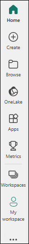    

1. In the left panel, click **Workspaces (1)** and then click on **+ New workspace (2)**. The **Create a workspace** dialog box opens.

     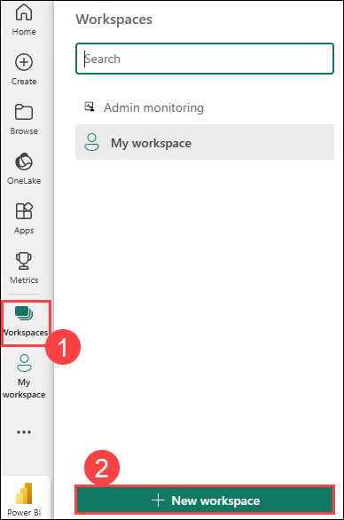   

1. In the **Create a workspace** dialog box, click on **Upload**.

     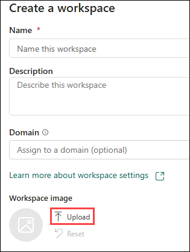 

1. A file browser dialog box opens. Navigate to `C:/DIAD/Data` and click on **VanArsdel_Logo** file.

1. Provide the name as **DIAD (1)** and the **Description** as **This is DIAD workspace (2)** and click on **Apply** to create the workspace.

     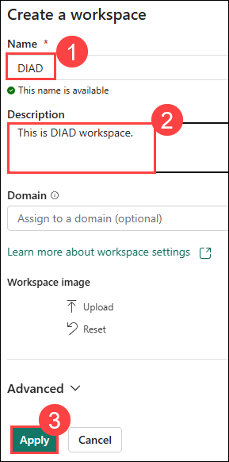 

1. Navigate to `C:\DIAD\Attendee\Attendee\Reports` and select the **DIADFinalReport**.

1. From the **Home** tab, click on **Publish (1)**. Select **DIAD (2)** in the dialog box and click on **Select (3)**.

     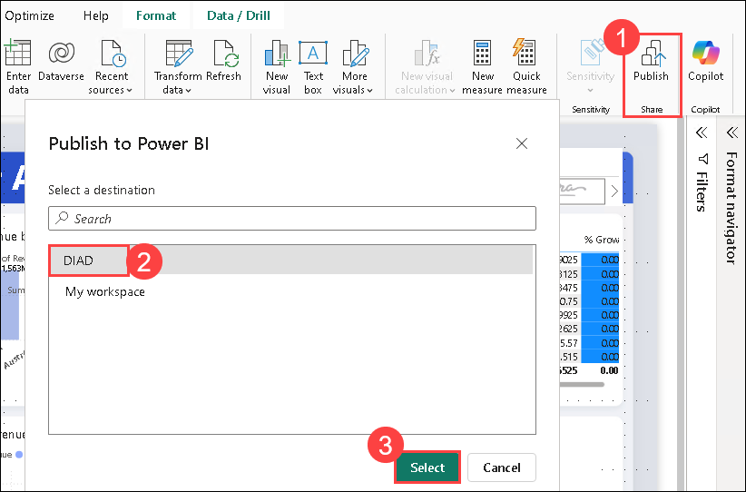 

      > **Note:** Click on **Save** if prompted.

1. The **Publishing to Power BI** dialog box opens. Click on **Got it**.

     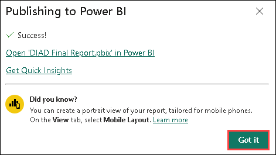 

### Task 2- Power BI – Building a Dashboard
  
1. Navigate back to the browser, select **DIAD (1)** and click on **DIAD Final Report (2)**.

     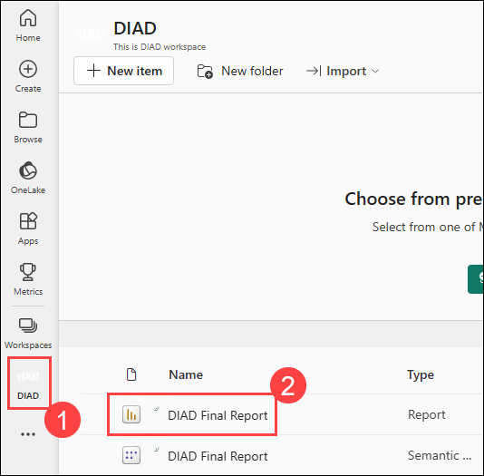 
  
1. In the **map visual**, enable drill-down by **hovering** over the visual.

1. Click the **down arrow** on the top right corner of the visual.

1. Select **Australia** to drill-down to the **State** level.

1. Hover over the **VanArsdel Market Share** card visual. Click the **pin** icon on the top right of the visual. 

     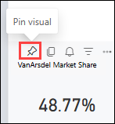 

1. Provide the dashboard name as **VanArsdel (1)** in the text box and click on **Pin (2)**.
  
     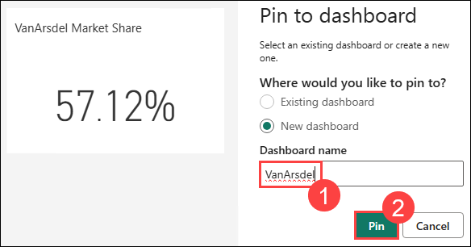 
 
1. We can verify by navigating to the **DIAD (1)** workspace and the **VanArsdel (2)** dashboard is created.

     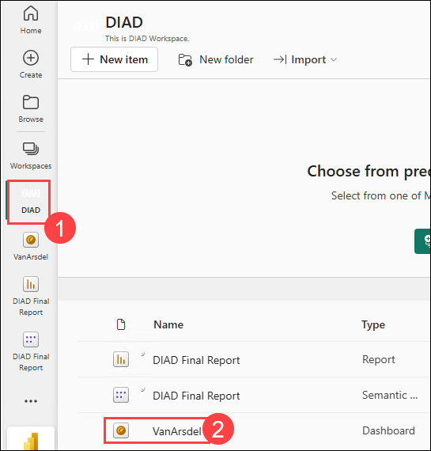  
  
1. Notice the **VanArsdel Market Share** tile is pinned to the dashboard.

     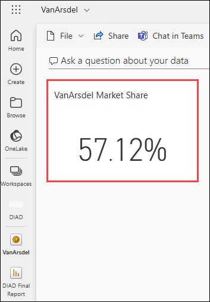  

1. Click **VanArsdel Market Share,** notice that you are navigated to the report.

      >**Note:** Tiles in the dashboard are not interactive.

1. Navigate back to the **DIAD Final Report**, hover over the **% Growth by Manufacturer** visual. Click the **pin** icon on the top right of the visual. 

     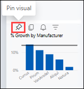 

1. Make sure that **VanArsdel** is selected in the drop-down and click on **Pin**.

     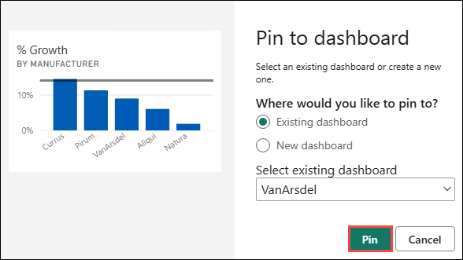  

1. Hover over the **Revenue by Year and Manufacturer** visual. Click the **pin** icon on the top right of the visual.

1. Make sure **VanArsdel** is selected in the drop-down and click on **Pin**.

     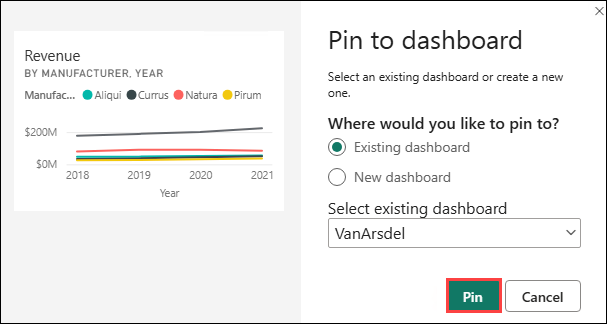  

1. Navigate to the **By Manufacturer (1)** page from the left pane. From the top right corner, click the **down arrow (2)**. 

     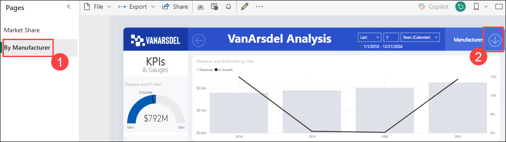  

1. Click **VanArsdel (1)** in the slicer. From the top right corner, click on the **up arrow (2)**. 

     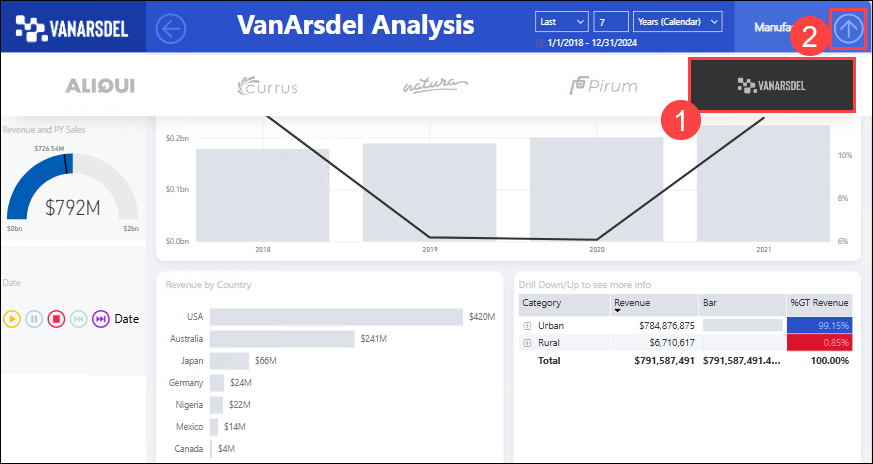  
  
1. Pin the **gauge visual** to the dashboard.

1. Pin the **Revenue by Country** visual to the dashboard.
  
      >**Note:** The **VanArsdel** filter is applied to the tile that is pinned to the dashboard.

1. Navigate to the **VanArsdel** dashboard. Notice that all the visuals are pinned as tiles to the dashboard.

     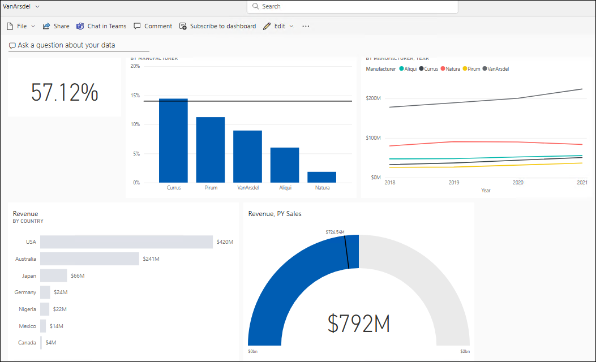

    > **Note:** Each visual on the dashboard is called a tile. The tiles represent the data chosen and are kept up to date as the data in the data model updates.

1. Resize and move the **gauge** tile.

1. Click the bottom right corner of the tile and move it diagonally to change the image size.

1. Click the **Edit (1)** dropdown and click on **Add tile (2)**.

     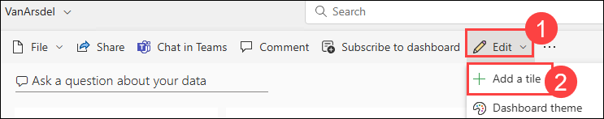

1. Click on **Image** as the source and click on **Next (2)**.

     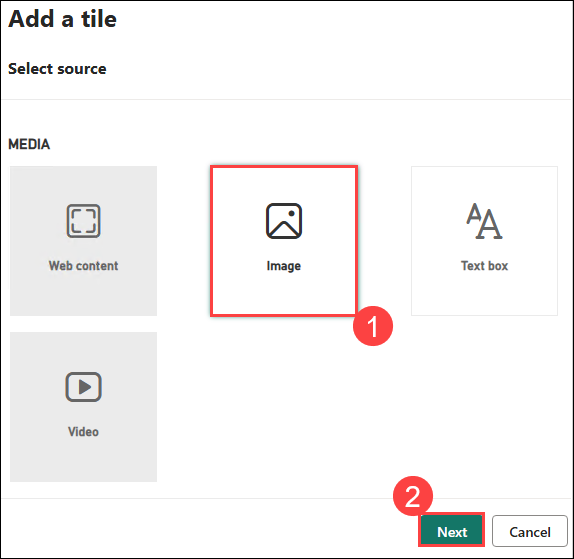

1. In the **URL** text box, add the following URL: <https://raw.githubusercontent.com/CharlesSterling/DiadManu/master/Vanarsdel.png> and click on **Apply**.

      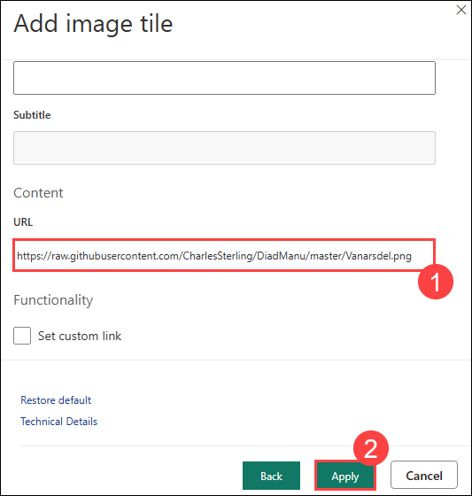 

     >**Note:** The URL is case sensitive.

1. Notice that a new tile with the **VanArsdel** logo is added to the dashboard.

      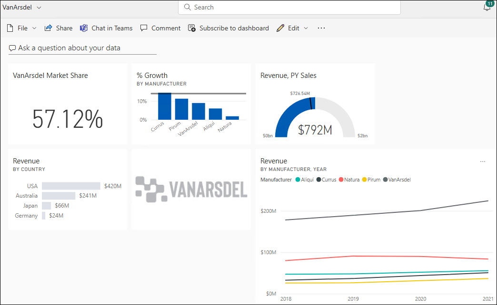 
  
1. Resize and rearrange the tiles.

1. Hover over **Revenue by Country** tile. Click on the **ellipsis** on the top right corner of the tile and click on **Edit Details**. 

      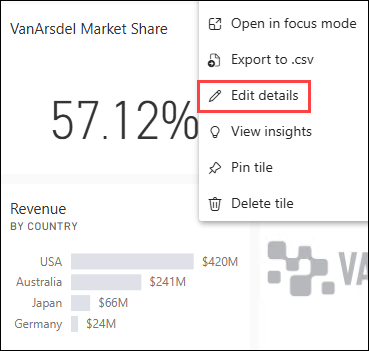 

1. Change the **Title** to **VanArsdel Revenue (1)** and click on **Apply(2)**.

      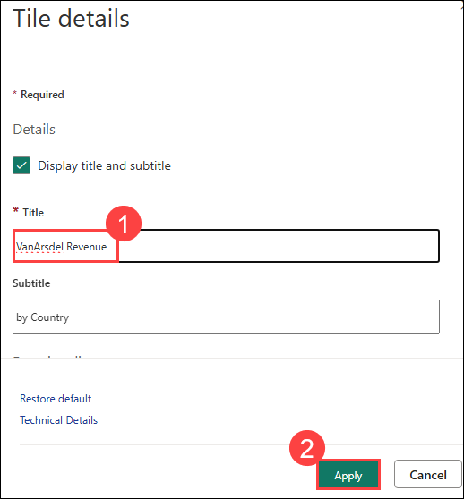 

1. Click on **Ask a question about your data** on the top left.

      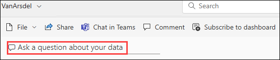 

1. In the text box, start typing **VanArsdel market share** and click on `Enter`. Notice that a card visual is created.

      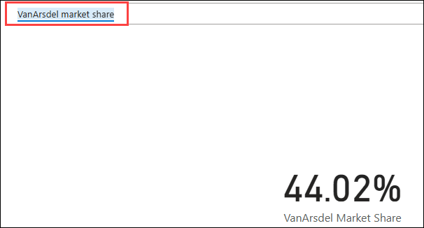 

1. Continue typing **VanArsdel market share by country**. Notice that a bar chart is created.

1. Continue typing **VanArsdel market share by country as treemap**. Notice that a treemap visual is created. In the top right of the screen, click **Pin Visual**.

      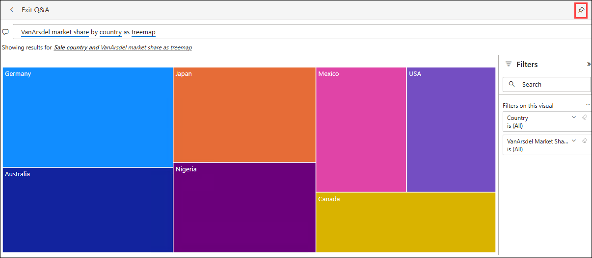

1. The **Pin to dashboard** dialog box opens. Click **Pin** to pin the visual to the **VanArsdel** dashboard.

      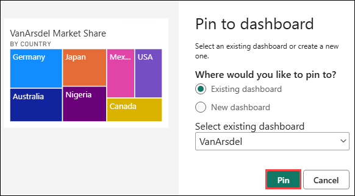 

1. Click on the **Exit Q&A** from the top left to navigate back to the dashboard.

      > **Note:** Notice that the visual is added as tile to the dashboard. Clicking on the treemap visual will navigate you back to the Q & A section.

1. Hover over the **line chart** on the dashboard. Click on the **ellipsis** on the top right corner and then click on **View Insights**.

      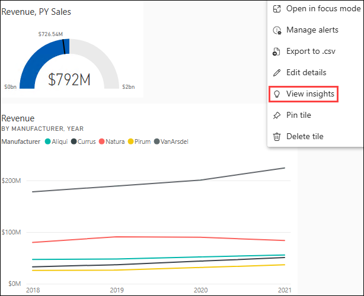 
  
      > **Note:** You will be navigated to **Focus mode** for the line chart.

      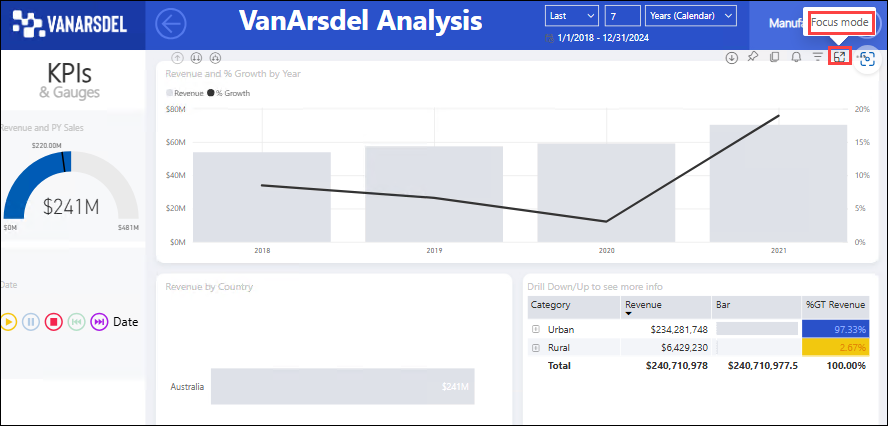 

1. Scroll on the Insights panel to review the various insights Power BI can generate.

      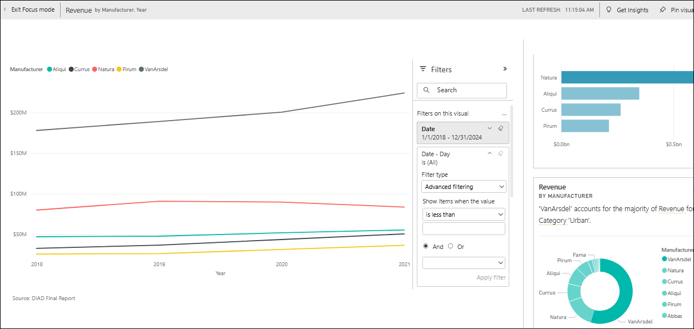 

1. Click on the **Exit Focus mode** from the top left to navigate back to the dashboard.

1. Hover over **VanArsdel Market Share** tile. Click on the **ellipsis (1)** in the top right corner of the tile. Select **Manage alerts (2)**. 

      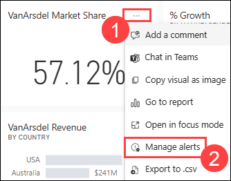 

1. Click **+ Add alert rule** option.

      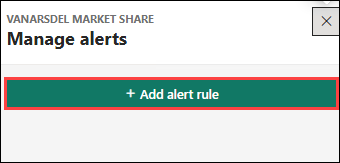 
  
      >  **Note:** Notice that you can add **Above** or **Below threshold**. You can also set the notification frequency. This is just an introduction to managing alerts. Complete functionality is not covered in this lab.

1. Click on **Cancel** to close the dialog box and click on **Don’t Save**.

1. Click on the **VanArsdel Market Share** tile to navigate to the report.

1. In the map visual, ensure it is at the **Country** level, right-click the **Australia** bubble, click **Drill through (1)**, and then select **By Manufacturer (2)**. 
  
      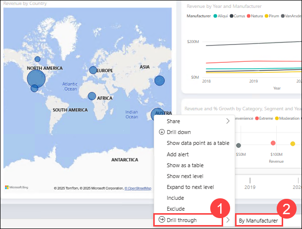 

      > **Note:** You will be navigated to the **By Manufacturer** page of the report with the **Australia** filter applied to the report page.

1. Hover over the **matrix** visual.

1. Click on the **focus mode** icon on the top right corner of the visual.

1. Click the **double-down arrow** to drill down. Click on **Back to report.**

      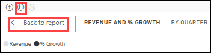 
  
1. From the top menu, click **Bookmarks (1)** and then click on **Add a Personal bookmark (2)**.

      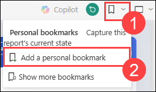 

      > **Note:**
      > - Report bookmarks are the bookmarks the report author created (we did this in Power BI Desktop).
      > - Personal bookmarks on the report are ones which the consumer can create on their own.

1. Click on **View** in the **Report** bookmarks pane.

      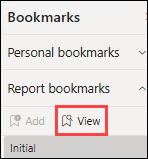 

      > **Note:** Notice that you can view and navigate through the bookmarks using the arrow at the bottom of the screen. This behavior is like in Power BI Desktop.
  
1. Click **Exit** in the **Bookmark** pane to close it.

1. Navigate to **DIAD (1)** workspace, click on the **ellpsis (2)** of the **DIAD Final Report** and then click on **Quick Insights (3)**.

      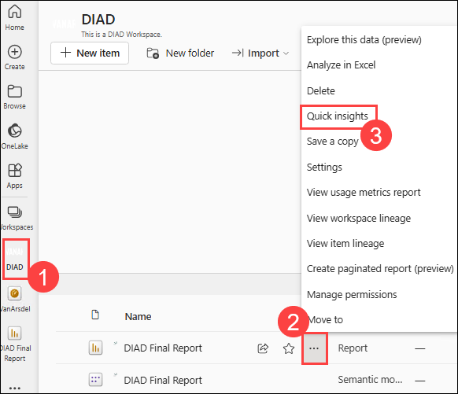 
  
      > **Note:** It might take a few minutes for the insights to be created. Once insights are ready, a message appears in the top right corner.

1. Click on **View insights.**

      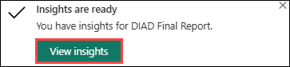 
  
1. A quick insights report is displayed based on the dataset. This provides insights into data you may have missed and helps to get a quick start on creating dashboards. Hovering over each report provides an option to **Pin it** to a dashboard.

      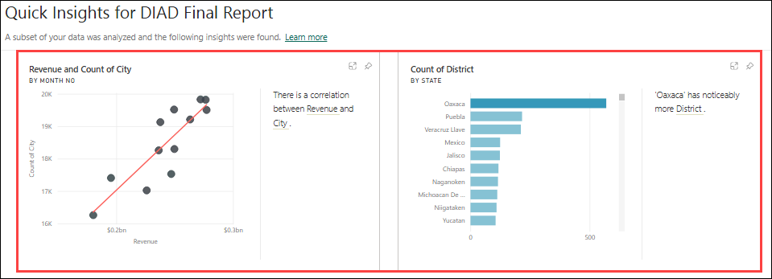

## Summary

In this lab, you have published the Report and built a Dashboard.

### You have successfully completed the lab!
