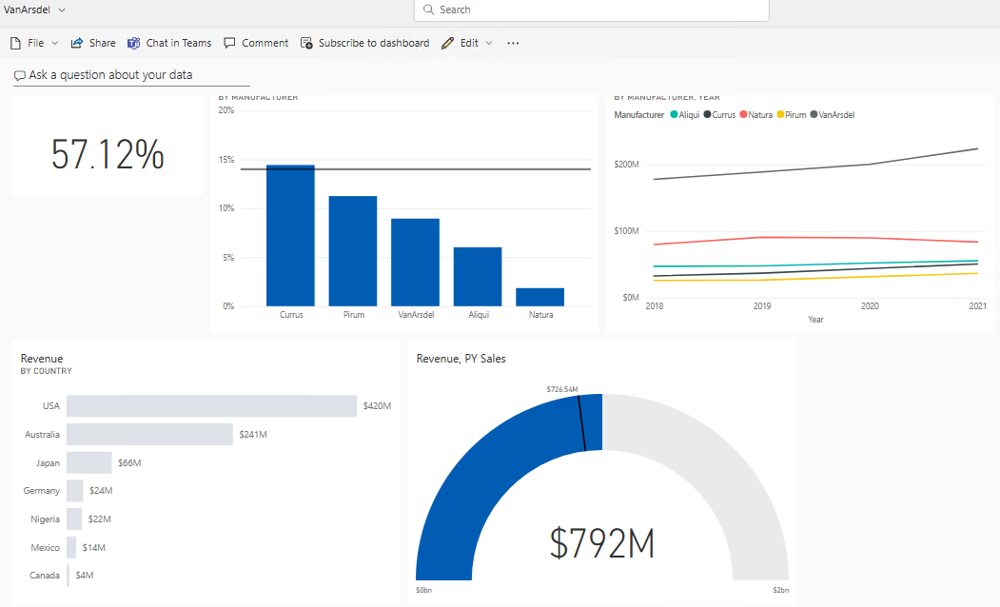

# Lab 5 - Publishing and Accessing Reports

### Estimated Duration: 40 Minutes

## Lab Objectives

In this lab, you will perform:

- Task 1 - Power BI Service – Publishing Report
- Task 2- Power BI – Building a Dashboard

### Task 1 - Power BI Service – Publishing Report

1. Navigate to <http://aka.ms/pbidiadtraining> and sign up:

   * Email/Username: <inject key="AzureAdUserEmail"></inject>

   * Password: <inject key="AzureAdUserPassword"></inject>     

1. Navigate to **app.powerbi.com** [http://app.powerbi.com](http://app.powerbi.com/)[.](http://app.powerbi.com/) and sign in if not already signed in.

1. Few of the options that are listed in the left navigation are as follows:

      - **Home**: This is a one-stop-shop for all your content. It lists your favorite and recent content such as reports, dashboards, and apps. It also shows the most recent content that was shared with you.
      
      - **Create**: Allows you to add data manually or use an already existing dataset.
      
      - **Apps**: List all the apps you have installed.
      
      - **Workspaces**: Lists all the workspaces you are assigned. By default, you are assigned to **My Workspace**.

          

1. In the left panel, click **Workspaces (1)** and then click on **+ New workspace (2)**. The **Create a workspace** dialog box opens.

        

1. In the **Create a workspace** dialog box, click on **Upload**.

      

1. A file browser dialog box opens. Navigate to `DIAD/Data` and click on **VanArsdel Logo** file.

1. Provide the name as **DIAD (1)** and the **Description** as **This is DIAD workspace (2)** and click on **Apply** to create the workspace.

      

1. Navigate to `C:\DIAD\Reports` and select the **DIADFinalReport**.

1. From the **Home** tab, click on **Publish (1)**. Select **DIAD (2)** in the dialog box and click on **Select (3)**.

      

1. The **Publishing to Power BI** dialog box opens. Click on **Got it**.

      

### Task 2- Power BI – Building a Dashboard
  
1. From the left menu, click **Reports** and then click on **DIAD (1)**. Click on **DIAD Final Report (2)**.

      
  
1. In the **map visual**, enable drill-down by **hovering** over the visual.

1. Click the **down arrow** on the top right corner of the visual.

1. Select **Australia** to drill-down to the **State** level.

1. Hover over the **VanArsdel Market Share** card visual. Click the **pin** icon on the top right of the visual. 

1. Provide the dashboard name as **VanArsdel (1)** in the text box and click on **Pin (2)**.
  
      
 
1. We can verify by navigating to the **DIAD (1)** workspace and the **VanArsdel (2)** dashboard is created.

       
  
1. Notice the **VanArsdel Market Share** tile is pinned to the dashboard.

       

1. Click **VanArsdel Market Share,** notice that you are navigated to the report.

      >**Note:** Tiles in the dashboard are not interactive.

1. Hover over the **% Growth by Manufacturer** visual. Click the **pin** icon on the top right of the visual. 

1. Make sure that **VanArsdel** is selected in the drop-down and click on **Pin**.

       

1. Hover over the **Revenue by Year and Manufacturer** visual. Click the **pin** icon on the top right of the visual.

1. Make sure **VanArsdel** is selected in the drop-down and click on **Pin**.

       

1. Navigate to the **By Manufacturer (1)** page from the left pane. From the top right corner, click the **down arrow (2)**. 

       

1. Click **VanArsdel (1)** in the slicer. From the top right corner, click on the **up arrow (2)**. 

       
  
1. Pin the **gauge visual** to the dashboard.

1. Pin the **Revenue by Country** visual to the dashboard.
  
      >**Note:** The **VanArsdel** filter is applied to the tile that is pinned to the dashboard.

1. Navigate to the **VanArsdel** dashboard. Notice that all the visuals are pinned as tiles to the dashboard.

     

    > **Note:** Each visual on the dashboard is called a tile. The tiles represent the data chosen and are kept up to date as the data in the data model updates.

1. Resize and move the **gauge** tile.

1. Click the bottom right corner of the tile and move it diagonally to change the image size.

1. Click the **Edit (1)** dropdown and click on **Add tile (2)**.

     

1. Click on **Image** as the source and click on **Next (2)**.

     

1. In the **URL** text box, add the following URL: <https://raw.githubusercontent.com/CharlesSterling/DiadManu/master/Vanarsdel.png> and click on **Apply**.

       

     >**Note:** The URL is case sensitive.

1. Notice that a new tile with the **VanArsdel** logo is added to the dashboard.

       
  
1. Resize and rearrange the tiles.

1. Hover over **Revenue by Country** tile. Click on the **ellipsis** on the top right corner of the tile and click on **Edit Details**. 

       

1. Change the **Title** to **VanArsdel Revenue (1)** and click on **Apply(2)**.

       

Now let’s create a visual that represents Market Share by country.

Notice on the top of the visual, there is an option to **Ask a question about your data**. This is like **Ask a question in the desktop**.

59. In the text box, start typing **VanArsdel market share.** Notice that a card visual is created.

60. Continue typing **VanArsdel market share by country**. Notice that a bar chart is created.

61. Continue typing **VanArsdel market share by country as treemap**. Notice that a treemap visual is created.

    
  
>**Note**: Remember that we renamed our tables. One of the reasons we did this was to make them user friendly for Q & A

62. In the top right of the screen, click **Pin Visual**.

63. The **Pin to dashboard** dialog box opens. Click **Pin** to pin the visual to the **VanArsdel** dashboard.

    
    
64. Close the alert dialog boxes.

65. Click **Exit Q&A** to navigate back to the dashboard.

Notice that the visual is added as tile to the dashboard. Clicking on the treemap visual will navigate you back to the Q & A section.

Power BI quickly searches different subsets of your dataset while applying a set of sophisticated algorithms to discover potentially interesting insights. You can run insights against a dataset or a dashboard tile.

Let’s generate insights on a dashboard tile. When we run insights on a dashboard tile, instead of searching for insights against an entire dataset, the search is narrowed to the data used to create a single dashboard tile. This is often referred to as scoped insights.

66. Hover over the **line chart** on the dashboard.

67. Click the **ellipse** on the top right corner.

68. Click **View Insights**.

    
  
You will be navigated to **Focus mode** for the line chart.

69. Scroll on the Insights panel to review the various insights Power BI can generate. Notice that there is an option to pin insight visuals to the dashboard.

    

70. Click **Exit Focus mode** in the top left to navigate back to the dashboard.

We want to be notified when VanArsdel’s Market Share goes above or below a threshold. We can set up alerts to achieve this.

71. Hover over **VanArsdel Market Share** tile.

72. Click on the **ellipse** in the top right corner of the tile.

73. Click **Manage alerts**. The **Manage alerts** dialog box opens.

74. Click **Add alert rule** dialog.

    
  
Notice that you can add **Above** or **Below threshold**. You can also set the notification frequency. This is just an introduction to managing alerts. Complete functionality is not covered in this lab.

75. Click **Cancel** to close the dialog box.

76. Click **Don’t Save**.

77. Click on the **VanArsdel Market Share** tile to navigate to the report.

78. In the map visual, ensure it is at the **Country** level, right-click the **Australia** bubble, click **Drill through**, and click then **By Manufacturer**. 
  
    

You will be navigated to the **By Manufacturer** page of the report with the **Australia** filter applied to the report page.

79. Hover over the **matrix** visual.

80. Click the **focus mode** icon on the top right corner of the visual.

81. Click the double-down arrow to drill down.

82. Click **Back to report.**

    
  
83. From the top menu, click **Bookmarks** and then click **Show more bookmarks**. The **Bookmark** pane opens on the right. There are two options: **Personal** bookmarks and **Report** bookmarks.

    
  
- Report bookmarks are the bookmarks the report author created (we did this in Power BI Desktop).

- Personal bookmarks on the report are ones which the consumer can create on their own.

84. Click **View** in the **Report** bookmarks pane.

Notice that you can view and navigate through the bookmarks using the arrow at the bottom of the screen. This behavior is like in Power BI Desktop.

  
  
85. Click **Exit** in the **Bookmark** pane to close it.

Power BI provides an option to get quick insights into the complete dataset.

86. Navigate back to the Power BI Service. In the left panel, hover over **Datasets** and then click **DIAD Final Report**.

87. Click the **ellipse**.

88. Click **Quick Insights**.

    
  
It might take a few minutes for the insights to be created. Once insights are ready, a message appears in the top right corner.

89. Click **View insights.**

    
  
A quick insights report is displayed based on the dataset. This provides insights into data you may have missed and helps to get a quick start on creating dashboards. Hovering over each report provides an option to **Pin it** to a dashboard.

  

You’ve now completed Lab four! Throughout this lab, you have learned how to apply conditional formatting, add a logo to the manufacturer filter, import a custom visual, and apply a custom theme to the report. You also learned how to add bookmarks to tell a story about the report.

## Summary

In this lab, you have published the Report and built a Dashboard.

### You have successfully completed the lab!
