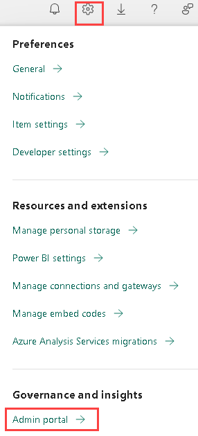

# Power BI: Dashboard-in-a-Day

## Getting Started with the Lab

1. Sign in to https://app.powerbi.com/ using the ODL credentials present under the Environemnt tab and click on **Submit**.

   * Email/Username: <inject key="AzureAdUserEmail"></inject>

2. Enter the following **Password** and click on **Sign in**. 
   
   * Password: <inject key="AzureAdUserPassword"></inject>   

3. In the **Stay Signed in?** pop-up, click on **No**. 

1. From the page header on the top right, click on **Settings (1)** and select **Admin portal (2)**.

   

1. In **Tenant settings** under Admin Portal, scroll down to **Integration settings**. Then, click on the **Map and filled map visuals** drop-down, toggle the button to **Enabled**.

   

1. Click on **Apply**.

   

1. **Sign out** and then **Sign in** to the account for changes to get applied.
