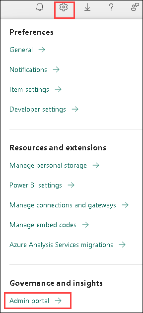
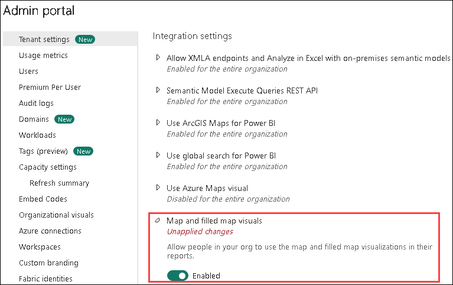
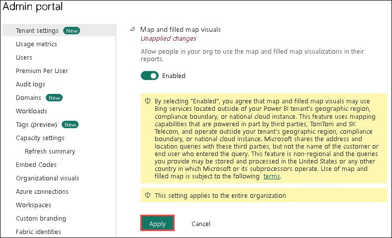

# Power BI: Dashboard-in-a-Day

## Overview

In this lab, you will explore the key features of the Power BI service, from authoring reports in Power BI Desktop to sharing insights via the Power BI Service. You will perform essential data transformations to optimize the data model, ensuring consistency and usability. The lab provides step-by-step guidance, including visual aids with highlighted key sections for clarity. You will finalize a Power BI report by applying conditional formatting, custom visuals, themes, and bookmarks for enhanced storytelling. Additionally, you will learn to share reports securely using Row-Level Security (RLS) and configure sharing permissions. 

## Objectives

In this lab, you will:

- **Accessing Data**: Explore data connectivity and integration in Power BI Desktop by importing and enhancing datasets.
- **Data Preparation**: Learn how to clean and transform data in Power BI Desktop by filling empty values, splitting and renaming columns, removing unwanted rows, transposing data, and appending queries.
- **Data Modeling and Exploration**: Explore the Power BI Desktop interface, focusing on layout and data exploration.
- **Data Visualization**: Learn to create interactive reports and compelling dashboards in Power BI for effective data visualization and insights.
- **Publishing and Accessing Reports**: Learn how to publish a Power BI report to the Power BI Service and build an interactive dashboard.
- **Share Power BI App in your Organization [READ-ONLY]**: Learn how to create an Azure AD user and manage permissions for Power BI reports and dashboards.

## Getting Started with the Lab

1. Sign in to https://app.powerbi.com/ using the ODL credentials present under the Environemnt tab and click on **Submit**.

   * Email/Username: <inject key="AzureAdUserEmail"></inject>

2. Enter the following **Password** and click on **Sign in**. 
   
   * Password: <inject key="AzureAdUserPassword"></inject>   

3. In the **Stay Signed in?** pop-up, click on **No**. 

1. From the page header on the top right, click on **Settings (1)** and select **Admin portal (2)**.

   

1. In **Tenant settings** under Admin Portal, scroll down to **Integration settings**. Then, click on the **Map and filled map visuals** drop-down, toggle the button to **Enabled**.

   

1. Click on **Apply**.

   

1. **Sign out** and then **Sign in** to the account for changes to get applied.
