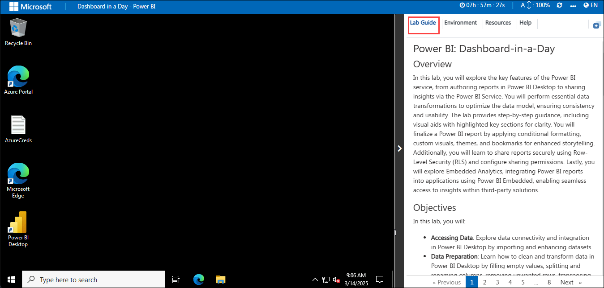
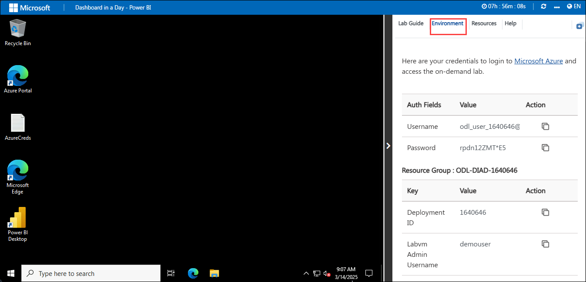
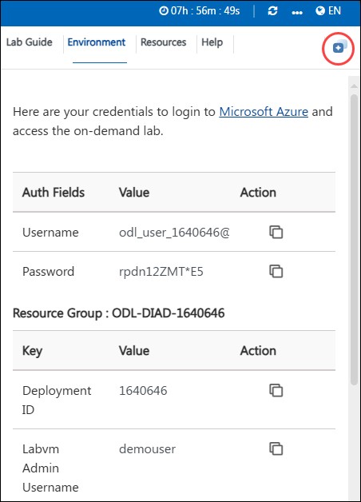
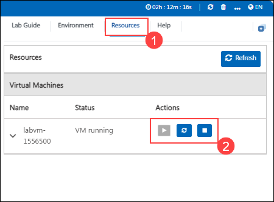
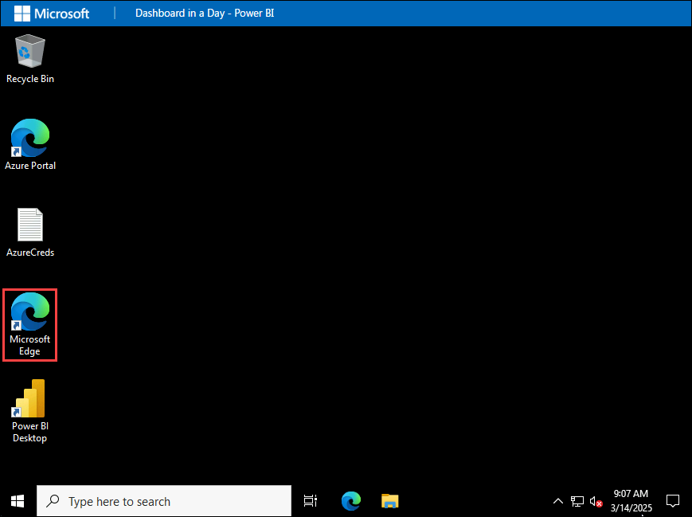

# Power BI: Dashboard-in-a-Day

## Overview

In this lab, you will explore the key features of the Power BI service, from authoring reports in Power BI Desktop to sharing insights via the Power BI Service. You will perform essential data transformations to optimize the data model, ensuring consistency and usability. The lab provides step-by-step guidance, including visual aids with highlighted key sections for clarity. You will finalize a Power BI report by applying conditional formatting, custom visuals, themes, and bookmarks for enhanced storytelling. Additionally, you will learn to share reports securely using Row-Level Security (RLS) and configure sharing permissions. 

## Objectives

In this lab, you will:

- **Accessing Data**: Explore data connectivity and integration in Power BI Desktop by importing and enhancing datasets.
- **Data Preparation**: Learn how to clean and transform data in Power BI Desktop by filling empty values, splitting and renaming columns, removing unwanted rows, transposing data, and appending queries.
- **Data Modeling and Exploration**: Explore the Power BI Desktop interface, focusing on layout and data exploration.
- **Data Visualization**: Learn to create interactive reports and compelling dashboards in Power BI for effective data visualization and insights.
- **Publishing and Accessing Reports**: Learn how to publish a Power BI report to the Power BI Service and build an interactive dashboard.
- **Share Power BI App in your Organization [READ-ONLY]**: Learn how to create an Azure AD user and manage permissions for Power BI reports and dashboards.

## Getting Started with the Lab
Welcome to your Power BI: Dashboard-in-a-Day Workshop! We've prepared a seamless environment for you to explore and learn about Power BI. Let's begin by making the most of this experience.
 
## Accessing Your Lab Environment
 
Once you're ready to dive in, your virtual machine and lab guide will be right at your fingertips within your web browser.

  

## Exploring Your Lab Resources
 
To get a better understanding of your lab resources and credentials, navigate to the **Environment** tab.
 
  
 
## Utilizing the Split Window Feature
 
For convenience, you can open the lab guide in a separate window by selecting the **Split Window** button from the Top right corner.
 
   

## Managing Your Virtual Machine
 
Feel free to start, stop, or restart your virtual machine as needed from the **Resources** tab. Your experience is in your hands!

  

## Lab Guide Zoom In/Zoom Out
 
1. To adjust the zoom level for the environment page, click the **A↕ : 100%** icon located next to the timer in the lab environment.

  

## Let's Get Started with Power BI

1. Click on **Microsoft Edge** from the desktop.

     

1. Navigate to `https://app.powerbi.com/`, sign in by using the Email given below and click on **Submit**.

   * Email/Username: <inject key="AzureAdUserEmail"></inject>

2. Enter the following **Password** and click on **Sign in**. 
   
   * Password: <inject key="AzureAdUserPassword"></inject>   

3. On the **Stay Signed in?** pop-up, click on **No**. 

1. From the page header on the top right, click on **Settings (1)** and select **Admin portal (2)**.

   

1. In **Tenant settings** under Admin Portal, scroll down to **Integration settings**. Then, click on the **Map and filled map visuals** drop-down, toggle the button to **Enabled**.

   

1. Click on **Apply**.

   

1. **Sign out** and then **Sign in** to the account for changes to get applied.

## Support Contact
The CloudLabs support team is available 24/7, 365 days a year, via email and live chat to ensure seamless assistance at any time. We offer dedicated support channels tailored specifically for both learners and instructors, ensuring that all your needs are promptly and efficiently addressed.

Learner Support Contacts:

   - Email Support: cloudlabs-support@spektrasystems.com
   - Live Chat Support: https://cloudlabs.ai/labs-support

Now you're all set to explore the powerful world of technology. Feel free to reach out if you have any questions along the way. Enjoy your workshop!

Now, click on **Next** from the lower right corner to move on to the next page.

  

## Happy Learning!!
